# mwango

<!-- START doctoc generated TOC please keep comment here to allow auto update -->
<!-- DON'T EDIT THIS SECTION, INSTEAD RE-RUN doctoc TO UPDATE -->
<details>
<summary>Table of Contents</summary>

- [環境設定](#%E7%92%B0%E5%A2%83%E8%A8%AD%E5%AE%9A)
  - [初期化](#%E5%88%9D%E6%9C%9F%E5%8C%96)
  - [ESLint](#eslint)
- [&#035;1. Controller, Service, Module](#1-controller-service-module)

</details>
<!-- END doctoc generated TOC please keep comment here to allow auto update -->

mwango さんの [コース](https://wanago.io/2020/05/11/nestjs-api-controllers-routing-module/) を実践する。

## 環境設定

### 初期化

まずは NestJS でプロジェクトを初期化する。

```bash
nest new mwango
```

なお、プロジェクトを初期化した際に生成されるファイルのうち、コントローラーやサービスに関しては不要なので削除しておく。

これで以下のようなシンプルなファイル構造が残っている。

```bash
src
├── app.module.ts
└── main.ts
```

### ESLint

次に ESLint の設定を追加する。

```bash
npm install --save-dev \
    eslint-plugin-import \
    eslint-plugin-jest \
    eslint-plugin-unused-imports
```

`.eslintrc.js` に追加する設定は、全て各ライブラリの公式サイトが推奨している設定を採用している。

## #1. Controller, Service, Module

NestJS ではクライアントから送信された HTTP リクエストを以下の流れで処理している。



アプリケーション全体の設定や特定の機能に関する設定を `Module` で行い、実際に HTTP リクエストのエンドポイントと対応するハンドラーを `Controller` に記述し、内部の処理は `Service` に記述するような構造である。

ではまずはブログの記事に対する CRUD を操作を実現するためのアプリケーションを作成する。

まずは下記のように CLI を使用して対応する機能を初期化していく。

```bash
nest generate module posts
nest generate controller posts --no-spec
```

これで以下のような構造で対応するファイルが作成された。

```bash
src
├── app.module.ts
├── main.ts
└── posts
    ├── posts.controller.ts
    ├── posts.module.ts
```
