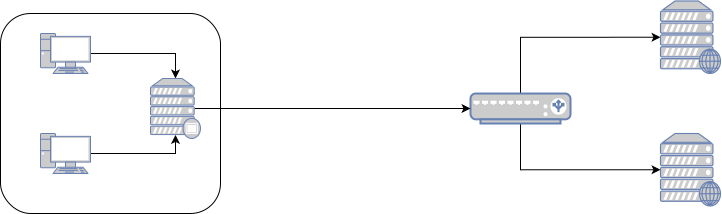

<!-- START doctoc generated TOC please keep comment here to allow auto update -->
<!-- DON'T EDIT THIS SECTION, INSTEAD RE-RUN doctoc TO UPDATE -->
<details>
<summary>Table of Contents</summary>

- [&#035;1 よく使うHTTPヘッダを理解する](#1-%E3%82%88%E3%81%8F%E4%BD%BF%E3%81%86http%E3%83%98%E3%83%83%E3%83%80%E3%82%92%E7%90%86%E8%A7%A3%E3%81%99%E3%82%8B)
  - [課題1 主要なHTTPヘッダの役割を理解する](#%E8%AA%B2%E9%A1%8C1-%E4%B8%BB%E8%A6%81%E3%81%AAhttp%E3%83%98%E3%83%83%E3%83%80%E3%81%AE%E5%BD%B9%E5%89%B2%E3%82%92%E7%90%86%E8%A7%A3%E3%81%99%E3%82%8B)
    - [Host](#host)
    - [Content-Type](#content-type)
    - [User-Agent](#user-agent)
    - [Accept](#accept)
    - [Referer](#referer)
    - [Accept-Encoding](#accept-encoding)
    - [Authorization](#authorization)
    - [Location](#location)
    - [Refererの追加質問](#referer%E3%81%AE%E8%BF%BD%E5%8A%A0%E8%B3%AA%E5%95%8F)
    - [コンテンツネゴシエーション](#%E3%82%B3%E3%83%B3%E3%83%86%E3%83%B3%E3%83%84%E3%83%8D%E3%82%B4%E3%82%B7%E3%82%A8%E3%83%BC%E3%82%B7%E3%83%A7%E3%83%B3)
  - [課題2 HTTPヘッダに関するクイズを作成する](#%E8%AA%B2%E9%A1%8C2-http%E3%83%98%E3%83%83%E3%83%80%E3%81%AB%E9%96%A2%E3%81%99%E3%82%8B%E3%82%AF%E3%82%A4%E3%82%BA%E3%82%92%E4%BD%9C%E6%88%90%E3%81%99%E3%82%8B)
    - [&#035;1 Quiz](#1-quiz)
    - [&#035;2 Quiz](#2-quiz)
    - [&#035;3 Quiz](#3-quiz)

</details>
<!-- END doctoc generated TOC please keep comment here to allow auto update -->

# #1 よく使うHTTPヘッダを理解する

## 課題1 主要なHTTPヘッダの役割を理解する

| ヘッダ名         | ヘッダ種類 | 送信元        |
| :--------------- | :--------- | :------------ |
| Host             | Request    | Client        |
| Content-Type     | Entity     | Client&Server |
| User-Agent       | Request    | Client        |
| Accept           | Request    | Client        |
| Referer          | Request    | Client        |
| Accept-Encopding | Request    | Client        |
| Authentication   | Request    | Client        |
| Location         | Response   | Server        |

---

### Host

Hostヘッダは、リクエストメッセージを制御するための、リクエストヘッダの1つである。

Hostヘッダの特徴は以下になる。

- http/1.1で、唯一必須項目のヘッダである。
- クライアントがサーバにリクエストを送信する際に、サーバのドメイン名（FQDN）とポート番号を設定する。
- 1つのサーバで複数のWebサイトを運用している場合、Hostヘッダに設定されているドメイン名をもとに、仮想ホストにリクエストを振り分ける。

参考資料

- [MDN Web Docs Host](https://developer.mozilla.org/ja/docs/Web/HTTP/Headers/Host)

---

### Content-Type

Content-Typeは、リクエストメッセージとレスポンスメッセージに含まれるメッセージボディを制御するための、エンティティヘッダの1つである。

Content-Typeヘッダの特徴は以下になる。

- リソースのメディア種別を示す
- 構文として以下の3要素を含む
  - media-type
  - charset
  - boundary

参考資料

- [MDN Web Docs Content-Type](https://developer.mozilla.org/ja/docs/Web/HTTP/Headers/Content-Type)

---

### User-Agent

User-Agentヘッダは、リクエストメッセージを制御するための、リクエストヘッダの1つである。

User-Agentヘッダの特徴は以下になる。

- ブラウザの種類やそのバージョン、OSの種類やそのバージョンに関する情報を含む。
- アクセス解析に使用できる。
- この情報をもとに、ユーザの環境に合わせてWebサイトのコンテンツを最適化できる
- ただし簡単に改変可能なので、過信に注意

参考資料

- [MDN Web Docs User-Agent](https://developer.mozilla.org/ja/docs/Web/HTTP/Headers/User-Agent)

---

### Accept

Acceptヘッダは、リクエストメッセージを制御するための、リクエストヘッダの1つである。

Acceptヘッダの特徴は以下になる。

- クライアントのブラウザが処理可能なファイルの種類と、その優先度をサーバに伝える
- 対応するファイルが存在しない場合は、サーバは「406 Not Acceptable」を返す
- 品質係数qvalueを、ファイルの種別ごとに設定して優先度を決定する
  - `image/png,image/jpeg;q=0.7,image/gif;q=0.5`

参考資料

- [MDN Web Docs Accept](https://developer.mozilla.org/ja/docs/Web/HTTP/Headers/Accept)

---

### Referer

Refererヘッダは、リクエストメッセージを制御するための、リクエストヘッダの1つである。

Refererヘッダの特徴は以下になる。

- 直前のリンク元のURIを示す
- サーバはクライアントがどのページからアクセスしたのかわかる
- これを使ってデータ解析して、プロモーションなどを決定することができる

参考資料
  
- [MDN Web Docs Referer](https://developer.mozilla.org/ja/docs/Web/HTTP/Headers/Referer)

---

### Accept-Encoding

Accept-Encodingヘッダは、リクエストメッセージを制御するための、リクエストヘッダの1つである。

Accept-Encodingヘッダの特徴は以下になる。

- クライアントのブラウザが処理できる圧縮方式をサーバに提示する
- サーバ側はContent-Encodingヘッダを使用して、選択した圧縮方式をクライアントに伝える
- クライアントとサーバが同じ圧縮方式を選択したとしても、その圧縮方式を採用しているとは限らない
  - サーバが過負荷状態であり、圧縮アルゴリズムを実行する際のオーバヘッドを処理できない場合
  - Microsoftは、計算リソースが80％以上残っている場合は、圧縮しないことをおすすめしている

参考資料

- [MDN Web Docs Accept-Encoding](https://developer.mozilla.org/ja/docs/Web/HTTP/Headers/Accept-Encoding)

---

### Authorization

Authorizationヘッダは、リクエストメッセージを制御するための、リクエストヘッダの1つである。

Authorizationヘッダの特徴は以下になる。

- ユーザをサーバで認証するための資格情報を含むこともある
- サーバが「401 Unauthorized」を返し、WWW-Authenticateヘッダを返した後の、リクエストに付与する

参考資料

- [MDN Web Docs Authorization](https://developer.mozilla.org/ja/docs/Web/HTTP/Headers/Authorization)

---

### Location

Locationヘッダは、レスポンスメッセージを制御するための、レスポンスヘッダの1つである。

Locationヘッダの特徴は以下になる。

- クライアントに、リダイレクト先を伝えるために使用する
- ステータスコードが「3XX」や「201」の場合にのみ意味を持つ
- ほとんどのWebブラウザは、自動的にLocationヘッダのURLにアクセスする

参考資料

- [MDN Web Docs Location](https://developer.mozilla.org/ja/docs/Web/HTTP/Headers/Location)

---

### Refererの追加質問

> aタグに`target="=blank"`を設定しており、`rel=noreferrer`を設定していなかった場合、どのような問題が発生するでしょうか

> 同じオリジンの時はrefererの情報を全部送って、別オリジンの時は、オリジン情報だけをrefererとして送信するために、HTTPリクエストのヘッダーにはどのような値を追加すればいいでしょうか

そもそものオリジンとは、とあるページの**プロトコル、ポート番号、ホスト**で定義されており、パスやクエリ文字列には依存していない。例えば、`https://example.com`に対して、同一オリジンかどうかは以下のように表にまとめることができる。

| URL                                 | 同一オリジン |
| ----------------------------------- | ------------ |
| https://example.com/first.html      | Yes          |
| https://example.com/second.html     | Yes          |
| http://example.com/first.html       | No           |
| https://example.com:8080/first.html | No           |
| https://example2.com/first.html     | No           |

HTTPリクエストの`Referer`ヘッダに設定する情報は、サーバ側のレスポンスヘッダである`Referrer-Policy`ヘッダで制御することができる。

なお、Referrerに設定する値には以下のパターンが存在している。

- 送信しない
- 送信する
  - オリジンのみ（`https://example.com/`）
  - 完全情報（オリジン、パス、クエリ文字列を含む）（`https://example.com/page.html?param1=example`）

実際の`Referrer-Policy`ヘッダに設定できる値は以下になる。

| Referrer-Policy                   | 同一オリジン | 異なるオリジン | HTTPS → HTTP | HTTP → HTTPS |
| --------------------------------- | ------------ | -------------- | ------------ | ------------ |
| `no-referrer`                     | ×            | ×              | ×            | ×            |
| `no-referrer-when-downgrade`      | 完全         | 完全           | ×            | 完全         |
| `origin`                          | オリジンのみ | オリジンのみ   | オリジンのみ | オリジンのみ |
| `origin-when-cross-origin`        | 完全         | オリジンのみ   | オリジンのみ | オリジンのみ |
| `same-origin`                     | 完全         | ×              | ×            | ×            |
| `strict-origin`                   | オリジンのみ | オリジンのみ   | ×            | オリジンのみ |
| `strict-origin-when-cross-origin` | 完全         | オリジンのみ   | ×            | オリジンのみ |
| `unsafe-url`                      | 完全         | 完全           | 完全         | 完全         |

そのほかの特徴は以下になる。

- `no-referrer-when-downgrade`
  - `Referrer-Policy`ヘッダが設定されていない場合のデフォルトの挙動
  - 最近は`strict-origin-when-cross-origin`をデフォルトにする動きあり

HTML内で上記の`Referrer-Policy`ヘッダを制御することが可能である。

```html
<!-- 文書全体に適用 -->
<meta name="referrer" content="origin">

<!-- aタグ、areaタグ、imgタグ、iframeタグ、scriptタグ、linkタグ -->
<a href="http://example.com" referrerpolicy="origin">

<!-- aタグ、areaタグ、linkタグ -->
<a href="http://example.com" rel="noreferrer">
```

参考資料

- [[MDN Web Docs] オリジン間リソース共有(CORS)](https://developer.mozilla.org/ja/docs/Web/HTTP/CORS#Preflighted_requests)
- [CORSまとめ](https://qiita.com/tomoyukilabs/items/81698edd5812ff6acb34)
- [Referer header: privacy and security concerns](https://developer.mozilla.org/en-US/docs/Web/Security/Referer_header:_privacy_and_security_concerns)
- [Referrer-Policy](https://developer.mozilla.org/en-US/docs/Web/HTTP/Headers/Referrer-Policy)
- [Links to cross-origin destinations are unsafe](https://web.dev/external-anchors-use-rel-noopener/)
- [Referrer を制御する](https://qiita.com/wakaba@github/items/707d72f97f2862cd8000)
- [W3C Referrer-Policy](https://triple-underscore.github.io/webappsec-referrer-policy-ja.html)
- [Markdown表テーブル作成ツール | NotePM](https://notepm.jp/markdown-table-tool)

---

### コンテンツネゴシエーション

サーバはHTML5やCSS、画像などの様々なファイルをリソースとして有している。クライアントが、URLを指定してこうしたリソースを取得しようとした場合、サーバ側は指定されたリソースのうち、クライアントに適したリソースを選択する（日本語のファイルや圧縮方式など）。

参考資料

- [Content Negotiation](https://developer.mozilla.org/en-US/docs/Web/HTTP/Content_negotiation)

## 課題2 HTTPヘッダに関するクイズを作成する

> 例：「User-agentを使って、ユーザがモバイル端末を使用していることを判定しようとした場合、どのような誤検知や問題が想定されるでしょうか？」

### #1 Quiz

阿部寛のHP（[here](http://abehiroshi.la.coocan.jp/)）にアクセスしてみる。2回目にサイトを訪問すると、レスポンスのステータスコードは「304 Not Modified」となっている。この挙動と関連するヘッダは何でしょうか。

<details>
<summary>回答例</summary>

上記の場合には、2つのHTTPヘッダが関連している。

| HTTPヘッダ    | 種別     | 内容                                                                                                                                                                                                                                | 例                                                          |
| ------------- | -------- | ----------------------------------------------------------------------------------------------------------------------------------------------------------------------------------------------------------------------------------- | ----------------------------------------------------------- |
| ETag          | Response | URLで指定されたリソースの特定バージョンの識別子である。<br>クライアントから要求されたリソースに対して、コンテンツが変更されていない場合は、レスポンス全体を再送しないようにすることで通信帯域を節約可となる。                       | `ETag: "33a64df551425fcc55e4d42a148795d9f25f89d4"`          |
| If-None-Match | Request  | `GET`および`HEAD`メソッドを使用してリソースの要求を行う場合、サーバ側の対象リソースが変更されている場合は、コンテンツ全体を含むレスポンスを取得する。<br>対象リソースが変更されていない場合は、キャッシュからコンテンツを読み込む。 | `If-None-Match: "bfc13a64729c4290ef5b2c2730249c88ca92d82d"` |



参考資料

- [[MDN Web Docs] ETag](https://developer.mozilla.org/ja/docs/Web/HTTP/Headers/ETag)
- [[MDN Web Docs] If-None-Match](https://developer.mozilla.org/ja/docs/Web/HTTP/Headers/If-None-Match)

</details>

### #2 Quiz

以下のネットワーク構成の場合、`X-Forwarded-For`を設定していなければ、どのような問題が発生するでしょうか。
また、実際の`X-Forwareded-For`の値はどのようになるでしょうか



<details>
<summary>回答例</summary>

例: `192.168.0.1`のクライアントから送信する場合

| タイミング           | X-Forwarded-For                       |
| -------------------- | ------------------------------------- |
| クライアント送信時   | なし                                  |
| プロキシサーバ通過時 | `192.168.0.1`                         |
| ロードバランサ通過時 | `192.168.0.1, 192.0.2.1`              |
| Webサーバ#1到着時    | `192.168.0.1, 192.0.2.1, 203.0.113.1` |

`X-Forwarded-For`ヘッダは、HTTPプロキシまたはロードバランサーを通過して、Webサーバへ接続するクライアントの、送信元IPアドレスを特定するための事実上の標準になっている。

`X-Forwarded-For`ヘッダを使用していない場合、リクエスト時のクライアントのプライベートIPアドレスは、プロキシ通過時にIPマスカレードによって、プロキシサーバのグローバルIPアドレスに変換される。ロードバランサでも同様にIPアドレスの変換が発生するため、送信元のクライアントのIPアドレスを特定できない。

> `X-Forwarded-For`は標準ではなく、RFC7239で標準化された`Forwarded`が標準である。新しいWebサイトを構築する場合には、`Forwarded`を付与することがいいのか?

参考資料

- [[MDN Web Docs] X-Forwarded-For](https://developer.mozilla.org/ja/docs/Web/HTTP/Headers/X-Forwarded-For)

</details>

### #3 Quiz

[clickjacking.html](./clickjacking.html)で生じているクリックジャッキングは、特定のHTTPヘッダをレスポンスヘッダに付与することで回避することができるが、それはどのようなヘッダと値になるでしょうか。

<details>
<summary>回答例</summary>

選択肢は2つ存在する。

- `X-Frame-Options`を設定する
- `Content-Security-Policy`を設定する

まずは`X-Frame-Options`ヘッダの内容を確認する。

- HTTPのレスポンスヘッダ
- ブラウザが取得したページを、`<frame>`, `<iframe>`, `<embed>`, `<object>`の中に表示することを許可するかどうかを決める
- サイト内のコンテンツが、他のサイトに埋め込まれないようにすることで、クリックジャッキング攻撃を防ぐことができる
- `Content-Security-Policy`ヘッダの`frame-ancestors`ディレクティブで代替できる

| ヘッダ値                      | 内容                                                     |
| :---------------------------- | :------------------------------------------------------- |
| `X-Frame-Options: DENY`       | ページをフレーム内に表示することを許可しない             |
| `X-Frame-Options: SAMEORIGIN` | ページ自体と同じオリジンのフレーム内でのみ表示を許可する |

次に`Content-Security-Policy`ヘッダの内容を確認する。

- クロスサイトスクリプティング(XSS)やデータインジェクション攻撃など、様々な種類の攻撃に対して対処することのできるセキュリティレイヤーになる
- 後方互換性のため、CSPに未対応のブラウザでも、CSP実装済みのサーバと通信でき、その反対も同様である

以下の設定例をいくつかの載せる

| ヘッダ値                                                                   | 内容                                                                                                 | 
| -------------------------------------------------------------------------- | ---------------------------------------------------------------------------------------------------- | 
| `Content-Security-Policy: default-src 'self'`                              | すべてのコンテンツをサイト自身のドメインから取得させる                                               | 
| `Content-Security-Policy: default-src 'self' *.trusted.com`                | 信頼されたドメインと、そのすべてのサブドメインからのコンテンツを許可したい                           | 
| `Content-Security-Policy: default-src https://onlinebanking.jumbobank.com` | リクエスト時の盗聴攻撃を防ぐため、すべてのコンテンツをLTSで読み込まさるためにHTTPSのみに制限している |

参考資料


- [[MDN Web Docs] Content-Security-Policy](https://developer.mozilla.org/ja/docs/Web/HTTP/CSP)
- [Google Web Fundamentals: コンテンツセキュリティポリシー](https://developers.google.com/web/fundamentals/security/csp)
- [[MDN Web Docs] X-Frame-Options](https://developer.mozilla.org/ja/docs/Web/HTTP/Headers/X-Frame-Options)
- [セキュリティ対策のHTTPヘッダがついているのかチェックするツール](https://securityheaders.com/)

</details>


  
  
