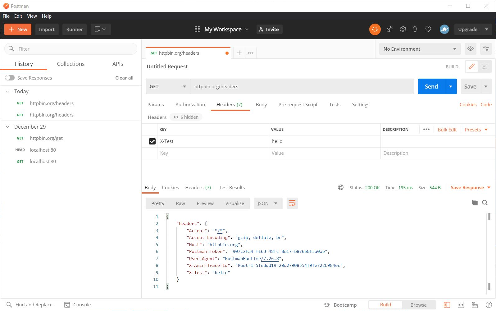
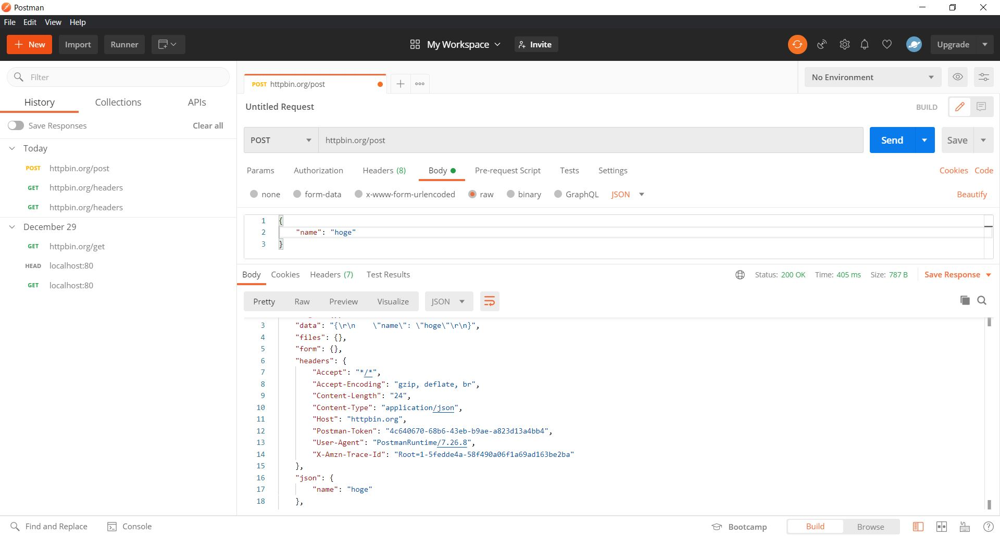
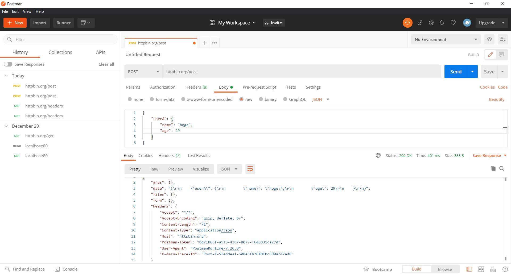
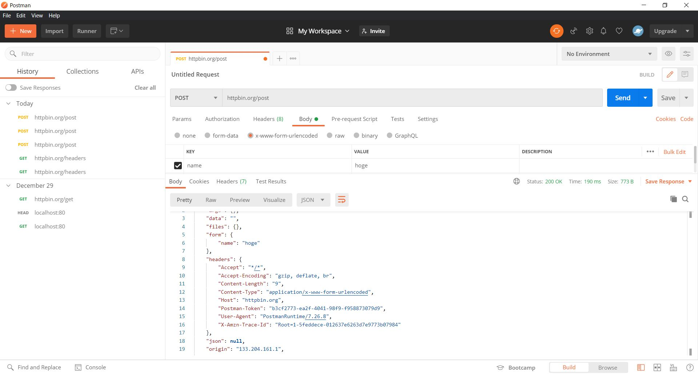

# #2 curlとpostmanに慣れる

課題に使用するcurlのバージョンは以下にな\る。

```bash
$ curl --version
curl 7.68.0 (x86_64-pc-linux-gnu) libcurl/7.68.0 OpenSSL/1.1.1f zlib/1.2.11 brotli/1.0.7 libidn2/2.2.0 libpsl/0.21.0 (+libidn2/2.2.0) libssh/0.9.3/openssl/zlib nghttp2/1.40.0 librtmp/2.3
Release-Date: 2020-01-08
Protocols: dict file ftp ftps gopher http https imap imaps ldap ldaps pop3 pop3s rtmp rtsp scp sftp smb smbs smtp smtps telnet tftp 
Features: AsynchDNS brotli GSS-API HTTP2 HTTPS-proxy IDN IPv6 Kerberos Largefile libz NTLM NTLM_WB PSL SPNEGO SSL TLS-SRP UnixSockets
```

- [cURL Tool Documentation](https://curl.se/docs/manpage.html)

また課題に取り組む際は、[`https://httpbin.org/`](https://httpbin.org/)と、ローカルのコンテナ上で動かしているhttpbinに対してcurlを実行する。

```bash
# コンテナ起動時のコマンド
$ docker run -it -d -p 80:80 --rm kennethreitz/httpbin
```

## 課題1

cURLにて、HTTPリクエスト内のHTTPヘッダをレスポンスで返すAPIである`https://httpbin.org/headers`に対してGETリクエストを発行する。その際にカスタムHTTPヘッダとして`X-Test: hello`を付与する。

```bash
# to https
$ curl -X GET -H "X-Test: hello" "https://httpbin.org/headers"

# to Docker Container
$ curl -X GET -H "X-Test: hello" "http://localhost:80/headers"
```

サービス提供元にリクエストを送信した場合

```json
{
  "headers": {
    "Accept": "*/*", 
    "Host": "httpbin.org", 
    "User-Agent": "curl/7.68.0", 
    "X-Amzn-Trace-Id": "Root=1-5fedcb94-43e04f8740f47ae43efbb7a9", 
    "X-Test": "hello"
  }
}
```

ローカルのDockerコンテナ上にリクエストを送信した場合

```json
{
  "headers": {
    "Accept": "*/*", 
    "Host": "localhost", 
    "User-Agent": "curl/7.68.0", 
    "X-Test": "hello"
  }
}
```

### 得られた知見

使用したcURLのオプション

| オプション                    | 設定例                      | 
| ----------------------------- | --------------------------- | 
| `-X, --request <command>`     | `-X GET`                    | 
| `-H, --header <header/@file>` | `-H "X-Custom-Header: XXX"` | 

送信先環境の違い

#### `Host`

`Host`にはリクエストの送信先のホスト名が入る。Dockerの場合はローカル環境が送信先になるため、`localhost`が格納されている。

#### `X-Amzn-Trace-Id`

サービス提供元へGETリクエストを送信した際、HTTPヘッダに`X-Amzn-Trace-Id`が確認された。

これはおそらく、httpbinにリクエストが送信される前段に、負荷分散のためにApplication Load Balancerを組み込みこんでおり、自動的にHTTPヘッダが追加されるため?

- [X-Amzn-Trace-Id を使用して Application Load Balancer リクエストをトレースする方法を教えてください。](https://aws.amazon.com/jp/premiumsupport/knowledge-center/trace-elb-x-amzn-trace-id/)

## 課題2

cURLにて、POSTリクエストを`https://httpbin.org/post`に送信する。その際にHTTPヘッダとして`Content-Type: "application/json"`を追加し、ボディには`{"name": "hoge"}`を追加してください。

```bash
# to https
$ curl -X POST -H "Content-Type: application/json" -d '{"name": "hoge"}' "https://httpbin.org/post"

# to Docker Container
$ curl -X POST -H "Content-Type: application/json" -d '{"name": "hoge"}' "http://localhost:80/post"
```

サービス提供元にリクエストを送信した場合

```bash
{
  "args": {}, 
  "data": "{\"name\": \"hoge\"}", 
  "files": {}, 
  "form": {}, 
  "headers": {
    "Accept": "*/*", 
    "Content-Length": "16", 
    "Content-Type": "application/json", 
    "Host": "httpbin.org", 
    "User-Agent": "curl/7.68.0", 
    "X-Amzn-Trace-Id": "Root=1-5fedd333-2004a9504bb454e574d7de23"
  }, 
  "json": {
    "name": "hoge"
  }, 
  "origin": "133.204.161.1", 
  "url": "https://httpbin.org/post"
}
```

ローカルのDockerコンテナ上にリクエストを送信した場合

```bash
{
  "args": {}, 
  "data": "{\"name\": \"hoge\"}", 
  "files": {}, 
  "form": {}, 
  "headers": {
    "Accept": "*/*", 
    "Content-Length": "16", 
    "Content-Type": "application/json", 
    "Host": "localhost", 
    "User-Agent": "curl/7.68.0"
  }, 
  "json": {
    "name": "hoge"
  }, 
  "origin": "172.17.0.1", 
  "url": "http://localhost/post"
}
```

### 得られた知見

使用したcURLのオプション

| オプション          | 設定例                  | 
| ------------------- | ----------------------- | 
| `-d, --data <data>` | `-d '{"name": "hoge"}'` | 

#### `origin`

`origin`の値には、クライアントの送信元IPアドレスが格納される。

Dockerコンテナの場合は、すべての通信がローカルネットワーク上で行われるため、ローカルIPアドレスが適用される。

サービス提供元の場合は、クライアントのローカルIPアドレスは、ブロードバンドルーターなどのNAT機能により、グローバルIPアドレスに変換されるため、サービス提供元からはこのグローバルIPアドレスしか見ることはできない。

- [あなたの情報確認くん](https://www.ugtop.com/spill.shtml)
- [IPアドレス確認（IPアドレスチェック）ツール](luft.co.jp/cgi/ipcheck.php)

## 課題3

多少複雑なボディである`{userA: {name: "hoge", age: 29}}`を同様にPOSTリクエストで送信してみましょう。

```bash
# to https
$ curl -X POST -H "Content-Type: application/json" -d '{"userA": {"name": "hoge", "age": 29}}'  "https://httpbin.org/post"

# to Docker Container
$ curl -X POST-H "Content-Type: application/json" -d '{"userA": {"name": "hoge", "age": 29}}' "http://localhost:80/post" 
```

サービス提供元にリクエストを送信した場合

```bash
{
  "args": {}, 
  "data": "{\"userA\": {\"name\": \"hoge\", \"age\": 29}}", 
  "files": {}, 
  "form": {}, 
  "headers": {
    "Accept": "*/*", 
    "Content-Length": "38", 
    "Content-Type": "application/json", 
    "Host": "httpbin.org", 
    "User-Agent": "curl/7.68.0", 
    "X-Amzn-Trace-Id": "Root=1-5fedd834-25b5dfa551e03cae54e1c547"
  }, 
  "json": {
    "userA": {
      "age": 29, 
      "name": "hoge"
    }
  }, 
  "origin": "133.204.161.1", 
  "url": "https://httpbin.org/post"
}
```

ローカルのDockerコンテナ上にリクエストを送信した場合

```bash
{
  "args": {}, 
  "data": "{\"userA\": {\"name\": \"hoge\", \"age\": 29}}", 
  "files": {}, 
  "form": {}, 
  "headers": {
    "Accept": "*/*", 
    "Content-Length": "38", 
    "Content-Type": "application/json", 
    "Host": "localhost", 
    "User-Agent": "curl/7.68.0"
  }, 
  "json": {
    "userA": {
      "age": 29, 
      "name": "hoge"
    }
  }, 
  "origin": "172.17.0.1", 
  "url": "http://localhost/post"
}
```

## 課題4

cURLにて、POSTリクエストを`https://httpbin.org/post`に送信する。その際にHTTPヘッダとして`Content-Type: "application/json"`を追加し、ボディには`{"name": "hoge"}`を追加してください。

```bash
# to https
$ curl -X POST -d '{"name": "hoge"}' "https://httpbin.org/post"

# to Docker Container
$ curl -X POST -d '{"name": "hoge"}' "http://localhost:80/post"
```

サービス提供元へリクエストを送信した場合

```bash
{
  "args": {}, 
  "data": "", 
  "files": {}, 
  "form": {
    "{\"name\": \"hoge\"}": ""
  }, 
  "headers": {
    "Accept": "*/*", 
    "Content-Length": "16", 
    "Content-Type": "application/x-www-form-urlencoded", 
    "Host": "httpbin.org", 
    "User-Agent": "curl/7.68.0", 
    "X-Amzn-Trace-Id": "Root=1-5fedd9b3-0e2949bc0f9c8fc0535346d7"
  }, 
  "json": null, 
  "origin": "133.204.161.1", 
  "url": "https://httpbin.org/post"
}
```

ローカルのDockerコンテナ上にリクエストを送信した場合

```bash
{
  "args": {}, 
  "data": "", 
  "files": {}, 
  "form": {
    "{\"name\": \"hoge\"}": ""
  }, 
  "headers": {
    "Accept": "*/*", 
    "Content-Length": "16", 
    "Content-Type": "application/x-www-form-urlencoded", 
    "Host": "localhost", 
    "User-Agent": "curl/7.68.0"
  }, 
  "json": null, 
  "origin": "172.17.0.1", 
  "url": "http://localhost/post"
}
```

### 得られた知見

リクエストの本文のタイプを指定する`Content-Type`は、指定しなければ`application/x-www-form-urlencoded`が格納される。

これはリクエストを以下のように変換することに等しい。

```bash
POST /post HTTP/1.1
HOST httpbin.org
Content-Type: application/x-www-form-urlencoded

name=hoge
```

なお`Content-Type`が上記の形式であれば、以下に定義されている単純リクエストの条件を満たすため、プリフライトリクエストは送信されない。

- `application/x-www-form-urlencoded`
- `multipart/form-data`
- `text/plain`

## 課題5

課題1



課題2



課題3



課題4



なお上記はローカル環境で立ち上げているPostmanのスナップショットになる。
オンライン環境で作成したリクエストをドキュメント化したものは以下に配置している。

[https://documenter.getpostman.com/view/9645891/TVt1ARGc](https://documenter.getpostman.com/view/9645891/TVt1ARGc)

## 参考資料

- [curl コマンド 使い方メモ](https://qiita.com/yasuhiroki/items/a569d3371a66e365316f)
- [よく使うcurlコマンドのオプション](https://qiita.com/ryuichi1208/items/e4e1b27ff7d54a66dcd9)
- [How to make a POST request with cURL](https://linuxize.com/post/curl-post-request/)
