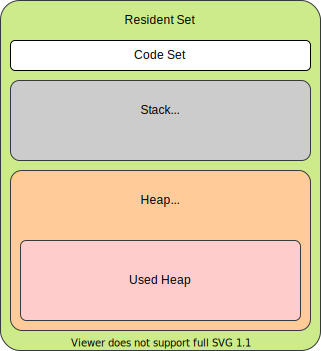

# リクエストをパースする Web サーバを構築する

<!-- START doctoc generated TOC please keep comment here to allow auto update -->
<!-- DON'T EDIT THIS SECTION, INSTEAD RE-RUN doctoc TO UPDATE -->
<details>
<summary>Table of Contents</summary>

- [リクエストをパースする Web サーバを構築する](#リクエストをパースする-web-サーバを構築する)
  - [課題 1](#課題-1)
    - [Express の実装メモ](#express-の実装メモ)
      - [body-parser](#body-parser)
      - [express.json と JSON.parse](#expressjson-と-jsonparse)
      - [レスポンスデータのエンベロープ](#レスポンスデータのエンベロープ)
    - [cURL](#curl)
    - [Postman](#postman)
    - [VSCode Rest Client](#vscode-rest-client)
    - [request.body はなぜストリーム形式なのか](#requestbody-はなぜストリーム形式なのか)
      - [参考資料](#参考資料)
    - [ストリームの挙動確認](#ストリームの挙動確認)
    - [JSのメモリ管理](#jsのメモリ管理)
  - [課題 2](#課題-2)
    - [`application/x-www-form-urlencoded`](#applicationx-www-form-urlencoded)
    - [`application/json`](#applicationjson)
    - [使い分け](#使い分け)

</details>
<!-- END doctoc generated TOC please keep comment here to allow auto update -->

## 課題 1

### Express の実装メモ

#### body-parser

リクエストを parse する際に、以前は`body-parser`モジュールが使用されていたが、Express4.x 以降からは`express`自体がラップを提供している。

- [expressの該当ソース](https://github.com/expressjs/express/blob/508936853a6e311099c9985d4c11a4b1b8f6af07/lib/express.js#L78)

#### express.json と JSON.parse

`Node.js`でJSONオブジェクトを取り扱う場合、リクエストボディに含まれているコンテンツをパースする場合には　`express.use(express.json())`　のようにミドルウェアを使用し、レスポンスボディを作成する際にはレスポンスオブジェクトの`res.json()`を使用する方法が通常のやり方である。

ここでJSONモジュールの`JSON.parse`を使用すると大きく性能が低下する。これは`JSON.parse`が同期処理にしか対応しておらず、ブロッキング処理となってしまうからである。

- [Node.js徹底攻略 ─ ヤフーのノウハウに学ぶ、パフォーマンス劣化やコールバック地獄との戦い方](https://eh-career.com/engineerhub/entry/2019/08/08/103000)

#### レスポンスデータのエンベロープ

書籍「Web API the Good Parts」では、レスポンスボディをJSON形式で設計する際に、エンベロープを含めないで設計する方がいいと記載されている。

これは以下のようにJSONオブジェクト内で、レスポンスのステータスコードなどを含めないようにすることであり、HTTPでのレスポンスラインやレスポンスヘッダに含まれる情報と冗長性を持たせないようにできる。

```json
{
  "meta": {
    "code": 404,
  },
  "data": {
    "message": "Not Found" 
  }
}
```

これは以下のようにメタ情報を含めない設計にすることが望ましい。

```json
{
  "message": "Invalid File"
}
```

- 参考
  - [Web APIのレスポンスにおいてエンベロープは必要か](https://teratail.com/questions/20730)

### cURL

[parsing-server](./parsing-server)フォルダで、`npm start`を実行した後で、 HTTP リクエストを送信した。

```bash
$ curl localhost:8080 -H "Content-Type: application/json"
{"text":"hello world"}

$ curl localhost:8080 -d '{"name": "hoge"}' -H "Content-Type: application/json"
{"name":"hoge"}

$ curl localhost:8080 -d '{"name": "hoge"}'
{"error":"400! Bad Request"}
```

### Postman

[https://documenter.getpostman.com/view/9645891/TVt2c3oU](https://documenter.getpostman.com/view/9645891/TVt2c3oU)

### VSCode Rest Client

単純なリクエストであれば VSCode の拡張機能である「[Rest Client](https://marketplace.visualstudio.com/items?itemName=humao.rest-client)」を使用することで VSCode 内でレスポンスの確認を完結させることができる。

以下のコマンドを`.http`という拡張子のファイルに記載しておけば、HTTP リクエストとそのレスポンスを確認することができる。

```bash
GET http://localhost:8080/ HTTP/1.1

###

POST http://localhost:8080/ HTTP/1.1
Content-Type: application/json

{
    "name": "hoge"
}

###

POST http://localhost:8080/ HTTP/1.1
Content-Type: application/x-www-form-urlencoded

name=hoge
```

### request.body はなぜストリーム形式なのか

- Nodejs の特徴

  - コールバック関数を利用したノンブロッキング I/O を提供する

    - 同期的的なファイル I/O

      ```js
      const fs = require("fs");
      const data = fs.readFileSync("./file.md");
      // 後続処理はファイル読み込みが終了するまでブロックされる
      ```

    - 非同期的なファイル I/O

      ```js
      const fs = require("fs");
      fs.reaFile("./file.md", (err, data) => {
        if (err) throw err;
      });
      // 後続処理はブロックされることなく実行される
      ```

- Nodejs でのストリームの取り扱い

  - Nodejs では`Stream`オブジェクトでデータストリームを扱っている
  - ノンブロッキング I/O の形式でファイルの読み書きを記載すると、以下のように書ける

    ```js
    fs.readFile("file.md", (err, data) => {
      fs.writeFile("dest.md", data);
    });
    ```

    - しかし上記の処理では、すべてのデータを読み切った後で、すべてのデータを書き込む処理になっている
    - 対象のファイルの容量が 2GB の場合には、メモリも同様に 2GB 消費することになる

  - ストリーム API を使用することで、ファイルをチャンクごとに読み込みから書き込みまで実行することができる。

    - ストリームをそのまま使用する場合

      ```js
      const src = fs.createReadStream("file.md");
      const dest = fs.createWriteStream("file.md");

      src.on("data", (chunk) => dest.write(chunk));
      src.on("end", () => dest.end());
      ```

    - `pipe()`を使用する場合

      ```js
      const src = fs.createReadStream("file.md");
      const dest = fs.createWriteStream("file.md");

      src.pipe(dest);
      ```

  - `body-parser`の例

    - `body-parser`でもストリーム形式でリクエストを処理している。

    - 例えば以下のように`Content-Encoding`をもとにパイプ処理を実行している。

      ```js
      function contentstream(req, debug, inflate) {
        var encoding = (
          req.headers["content-encoding"] || "identity"
        ).toLowerCase();
        // ...

        switch (encoding) {
          case "deflate":
            stream = zlib.createInflate();
            debug("inflate body");
            req.pipe(stream);
            break;
          case "gzip":
            stream = zlib.createGunzip();
            debug("gunzip body");
            req.pipe(stream);
            break;
          case "identity":
            stream = req;
            stream.length = length;
            break;
        }
      }
      ```

    - 参考資料

      - [body-parser の該当処理](https://github.com/expressjs/body-parser/blob/master/lib/read.js#L158)

#### 参考資料

- [Nodejs Stream API](https://nodejs.org/api/stream.html)
- [ブロッキングとノンブロッキングの概要](https://nodejs.org/ja/docs/guides/blocking-vs-non-blocking/)
- [stremn-handbook](https://github.com/meso/stream-handbook)
- [Node.js の Stream API の概要](https://qiita.com/takaaki7/items/fbc33dff1e17fe6a3d38)
- [Node.js Stream を使いこなす](https://qiita.com/masakura/items/5683e8e3e655bfda6756)
- [ストリーム処理とは何か？＋ 2016 年の出来事](https://qiita.com/kimutansk/items/60e48ec15e954fa95e1c)
- [Why is Node.js scalable?](https://stackoverflow.com/questions/16949483/why-is-node-js-scalable)
- [Node.js の Stream API で大量プッシュ通知を高速化するテクニック (1/2)](https://www.atmarkit.co.jp/ait/articles/1502/12/news026.html)

### ストリームの挙動確認

ストリームの実際の挙動を[streaming](./streaming)フォルダで確認した。

まずはランダムなテキストファイルを作成するために、以下のコマンドを使用して`text.txt`を生成する。

```bash
# 100MBのテキストデータを作成する
base64 /dev/urandom | head -c 10000000 > text.txt
```

以下にストリームを使用した場合と、そうではない場合とのメモリ使用量を見てみる。

まずはストリームを使用しない場合を見てみると、オブジェクトに対して確保されるヒープ領域に、ファイルサイズと同程度のメモリが確保されていることがわかる。

```bash
$ node app-non-stream.js
>>
File size: 95.367431640625 MB
Memory: rss: 223.14 MB, heapTotal: 102.88 MB, heapUsed: 97.44 MB, external: 96.33 MB, arrayBuffers: 95.38 MB
```

次にストリームを使用した場合では、65536バイト（=`2^16`バイト、TCPパケットの最大サイズ）程度のチャンクが生成されており、ヒープ領域のメモリ使用量もかなり抑えられていることがわかる。

```bash
$ node app-stream.js
>>
File size: 95.367431640625 MB
Read bytelength:  65536
Memory: rss: 41.73 MB, heapTotal: 8.31 MB, heapUsed: 3.52 MB, external: 1.22 MB, arrayBuffers: 0.26 MB
~~~
Read bytelength:  65536
Memory: rss: 41.73 MB, heapTotal: 8.31 MB, heapUsed: 3.58 MB, external: 1.28 MB, arrayBuffers: 0.32 MB
Read bytelength:  57600
Memory: rss: 41.73 MB, heapTotal: 8.31 MB, heapUsed: 3.64 MB, external: 1.34 MB, arrayBuffers: 0.38 MB
end
Memory: rss: 41.73 MB, heapTotal: 8.31 MB, heapUsed: 3.65 MB, external: 1.34 MB, arrayBuffers: 0.38 MB
```

以上の結果を見てみても、巨大なファイルを取り扱う場合にはストリーム形式を使用したほうがいいことがわかる。

### JSのメモリ管理

- JavaScript のメモリ管理の概要

  - オブジェクトや文字列などの実体の生成時にメモリが割り当てられ、使用されてなくなると**ガベージコレクタ**により自動的にメモリは解放される。
  
- メモリーライフサイクル

  - プログラミング言語に関係なく、メモリのライフサイクルは以下の流れである。

    1. 必要なメモリを割り当てる
    
    2. 割り当てられたメモリを使用する（Read、Write）
    
    3. 必要なくなったら割り当てられたメモリを解放する

  - JavaScript などの高級言語では 1 と 3 が暗黙的に実行されることが多い

- ストリーム処理との関連

  - Node.js でのメモリ管理では、実行エンジンである `V8` エンジンのメモリスキームを理解する必要がある。
  
    - 実行中のプログラムは、メモリ空間に割り当てられている複数の空間（`Resident Set`）から構成されている。
    
    - V8 では JVM のようにメモリ空間を複数のセグメントに分割している。
      
      - `Code`: 実行中のプログラム
      
      - `Stack`: プリミティブ型の値や、ヒープ領域のオブジェクトへのポインタ
      
      - `Heap`: オブジェクトや文字列、クロージャ
    
        
    
    - `process.memoryUsage()`で出力される内容
    
      - `rss`: Resident Set Size
      
      - `heapTotal`: Heap
      
      - `heapUsed`: Used Heap

参考資料

- [メモリの管理](https://developer.mozilla.org/ja/docs/Web/JavaScript/Memory_Management)
- [Understanding Garbage Collection and hunting Memory Leaks in Node.js](https://www.dynatrace.com/news/blog/understanding-garbage-collection-and-hunting-memory-leaks-in-node-js/)

## 課題 2

POST リクエストを送信する際に、`Content-Type`による挙動の違いをまとめる。

### `application/x-www-form-urlencoded`

```bash
$ curl https://httpbin.org/post \
  --request POST \
  --data "name=hoge"

>>
POST /post HTTP/2
Host: httpbin.org
user-agent: curl/7.68.0
accept: */*
content-length: 9
content-type: application/x-www-form-urlencoded

name=hoge
```

### `application/json`

```bash
$ curl https://httpbin.org/post \
  --request POST \
  --data '{"name": "hoge"}' \
  --header "Content-Type: application/json"

>>
POST /post HTTP/2
Host: httpbin.org
user-agent: curl/7.68.0
accept: */*
content-type: application/json
content-length: 16

{"name": "hoge"}
```

### 使い分け

| Content-Type | `x-www-form-urlencoded`                                                           | `json`                                |
| ------------ | --------------------------------------------------------------------------------- | ------------------------------------- |
| データ形式   | key=value                                                                         | {"key": "value"}                      |
| 用途         | HTML フォームを介した POST リクエスト                                             | XMLHttpRequest<br>Fetch API           |
| 特徴         | - json のような階層構造のデータを扱うことは難しい<br>- パーセントエンコーディング | - 近年の API でよく使用されている形式 |

- 参考資料

  - [[MDN Web Docs] POST](https://developer.mozilla.org/ja/docs/Web/HTTP/Methods/POST)
  - [[OAUTH-WG] application/x-www-form-urlencoded vs JSON](https://mailarchive.ietf.org/arch/msg/oauth/D4d6dCQSvmO1G3ST5q6_xQ6En4w/)
