# 課題4 Cookieを理解する

<!-- START doctoc generated TOC please keep comment here to allow auto update -->
<!-- DON'T EDIT THIS SECTION, INSTEAD RE-RUN doctoc TO UPDATE -->
<details>
<summary>Table of Contents</summary>

- [Cookieの挙動を理解する](#cookie%E3%81%AE%E6%8C%99%E5%8B%95%E3%82%92%E7%90%86%E8%A7%A3%E3%81%99%E3%82%8B)
  - [Cookieとは何か](#cookie%E3%81%A8%E3%81%AF%E4%BD%95%E3%81%8B)
  - [Cookieの生成](#cookie%E3%81%AE%E7%94%9F%E6%88%90)
  - [Cookieのオプション](#cookie%E3%81%AE%E3%82%AA%E3%83%97%E3%82%B7%E3%83%A7%E3%83%B3)
- [課題1](#%E8%AA%B2%E9%A1%8C1)
  - [`www.hoge.com`で発行されたクッキーは`www.fuga.com`にも送信されるのか](#wwwhogecom%E3%81%A7%E7%99%BA%E8%A1%8C%E3%81%95%E3%82%8C%E3%81%9F%E3%82%AF%E3%83%83%E3%82%AD%E3%83%BC%E3%81%AFwwwfugacom%E3%81%AB%E3%82%82%E9%80%81%E4%BF%A1%E3%81%95%E3%82%8C%E3%82%8B%E3%81%AE%E3%81%8B)
  - [`hoge.com:8080`で発行されたクッキーは`hoge.com:9090`に送信されるのか](#hogecom8080%E3%81%A7%E7%99%BA%E8%A1%8C%E3%81%95%E3%82%8C%E3%81%9F%E3%82%AF%E3%83%83%E3%82%AD%E3%83%BC%E3%81%AFhogecom9090%E3%81%AB%E9%80%81%E4%BF%A1%E3%81%95%E3%82%8C%E3%82%8B%E3%81%AE%E3%81%8B)
  - [`www.hoge.com`で発行されたクッキーは`www.api.hoge.com`にも送信されるのか](#wwwhogecom%E3%81%A7%E7%99%BA%E8%A1%8C%E3%81%95%E3%82%8C%E3%81%9F%E3%82%AF%E3%83%83%E3%82%AD%E3%83%BC%E3%81%AFwwwapihogecom%E3%81%AB%E3%82%82%E9%80%81%E4%BF%A1%E3%81%95%E3%82%8C%E3%82%8B%E3%81%AE%E3%81%8B)
  - [`Set-Cookie: Domain=hoge.com`を設定した場合に`api.hoge.com`にもクッキーは送信されるのか](#set-cookie-domainhogecom%E3%82%92%E8%A8%AD%E5%AE%9A%E3%81%97%E3%81%9F%E5%A0%B4%E5%90%88%E3%81%ABapihogecom%E3%81%AB%E3%82%82%E3%82%AF%E3%83%83%E3%82%AD%E3%83%BC%E3%81%AF%E9%80%81%E4%BF%A1%E3%81%95%E3%82%8C%E3%82%8B%E3%81%AE%E3%81%8B)
  - [ブラウザからクッキーの値が取得できないようにすることは可能なのか](#%E3%83%96%E3%83%A9%E3%82%A6%E3%82%B6%E3%81%8B%E3%82%89%E3%82%AF%E3%83%83%E3%82%AD%E3%83%BC%E3%81%AE%E5%80%A4%E3%81%8C%E5%8F%96%E5%BE%97%E3%81%A7%E3%81%8D%E3%81%AA%E3%81%84%E3%82%88%E3%81%86%E3%81%AB%E3%81%99%E3%82%8B%E3%81%93%E3%81%A8%E3%81%AF%E5%8F%AF%E8%83%BD%E3%81%AA%E3%81%AE%E3%81%8B)
  - [HTTPS通信の場合だけクッキーを送信することはできるのか](#https%E9%80%9A%E4%BF%A1%E3%81%AE%E5%A0%B4%E5%90%88%E3%81%A0%E3%81%91%E3%82%AF%E3%83%83%E3%82%AD%E3%83%BC%E3%82%92%E9%80%81%E4%BF%A1%E3%81%99%E3%82%8B%E3%81%93%E3%81%A8%E3%81%AF%E3%81%A7%E3%81%8D%E3%82%8B%E3%81%AE%E3%81%8B)
  - [クッキーに`Expires`を設定した場合の挙動はどうなるでしょうか](#%E3%82%AF%E3%83%83%E3%82%AD%E3%83%BC%E3%81%ABexpires%E3%82%92%E8%A8%AD%E5%AE%9A%E3%81%97%E3%81%9F%E5%A0%B4%E5%90%88%E3%81%AE%E6%8C%99%E5%8B%95%E3%81%AF%E3%81%A9%E3%81%86%E3%81%AA%E3%82%8B%E3%81%A7%E3%81%97%E3%82%87%E3%81%86%E3%81%8B)
  - [`SameSite`を設定した場合の挙動はどうなるでしょうか](#samesite%E3%82%92%E8%A8%AD%E5%AE%9A%E3%81%97%E3%81%9F%E5%A0%B4%E5%90%88%E3%81%AE%E6%8C%99%E5%8B%95%E3%81%AF%E3%81%A9%E3%81%86%E3%81%AA%E3%82%8B%E3%81%A7%E3%81%97%E3%82%87%E3%81%86%E3%81%8B)
  - [クッキーに格納してはいけない情報として3つ例をあげてみましょう](#%E3%82%AF%E3%83%83%E3%82%AD%E3%83%BC%E3%81%AB%E6%A0%BC%E7%B4%8D%E3%81%97%E3%81%A6%E3%81%AF%E3%81%84%E3%81%91%E3%81%AA%E3%81%84%E6%83%85%E5%A0%B1%E3%81%A8%E3%81%97%E3%81%A63%E3%81%A4%E4%BE%8B%E3%82%92%E3%81%82%E3%81%92%E3%81%A6%E3%81%BF%E3%81%BE%E3%81%97%E3%82%87%E3%81%86)
  - [クッキーとローカルストレージはどのように使い分ければいいでしょうか](#%E3%82%AF%E3%83%83%E3%82%AD%E3%83%BC%E3%81%A8%E3%83%AD%E3%83%BC%E3%82%AB%E3%83%AB%E3%82%B9%E3%83%88%E3%83%AC%E3%83%BC%E3%82%B8%E3%81%AF%E3%81%A9%E3%81%AE%E3%82%88%E3%81%86%E3%81%AB%E4%BD%BF%E3%81%84%E5%88%86%E3%81%91%E3%82%8C%E3%81%B0%E3%81%84%E3%81%84%E3%81%A7%E3%81%97%E3%82%87%E3%81%86%E3%81%8B)
  - [Web掲示板サービス開発している際に、XSSにより他ユーザのクッキー情報が抜き出される仕組みとその対策はどのようなものでしょうか](#web%E6%8E%B2%E7%A4%BA%E6%9D%BF%E3%82%B5%E3%83%BC%E3%83%93%E3%82%B9%E9%96%8B%E7%99%BA%E3%81%97%E3%81%A6%E3%81%84%E3%82%8B%E9%9A%9B%E3%81%ABxss%E3%81%AB%E3%82%88%E3%82%8A%E4%BB%96%E3%83%A6%E3%83%BC%E3%82%B6%E3%81%AE%E3%82%AF%E3%83%83%E3%82%AD%E3%83%BC%E6%83%85%E5%A0%B1%E3%81%8C%E6%8A%9C%E3%81%8D%E5%87%BA%E3%81%95%E3%82%8C%E3%82%8B%E4%BB%95%E7%B5%84%E3%81%BF%E3%81%A8%E3%81%9D%E3%81%AE%E5%AF%BE%E7%AD%96%E3%81%AF%E3%81%A9%E3%81%AE%E3%82%88%E3%81%86%E3%81%AA%E3%82%82%E3%81%AE%E3%81%A7%E3%81%97%E3%82%87%E3%81%86%E3%81%8B)
- [参考資料](#%E5%8F%82%E8%80%83%E8%B3%87%E6%96%99)

</details>
<!-- END doctoc generated TOC please keep comment here to allow auto update -->

## Cookieの挙動を理解する

課題1への回答を記載する前に、Cookieの基礎知識をまとめる。

### Cookieとは何か

Cookieとは、サーバがクライアントのブラウザに送信するデータである。
ブラウザは、渡されたデータを保存し、その後のリクエストとともに同じサーバにデータを返送する。

こうすることで、異なるリクエスト間で状態を持たせることが可能となる。
用途は主に3つ存在する。

- セッション管理
  - ログイン
  - ショッピングカート
  - ゲームのスコア
  - そのほかのサーバが保持しておくべきもの
- パーソナライゼーション
  - ユーザ設定
  - テーマ
  - その他の設定
- トラッキング
  - ユーザの行動の記録
  - 分析

### Cookieの生成

Cookieはサーバ側は`Set-Cookie`ヘッダを使用し、クライアントは`Cookie`ヘッダを使用する。
Cookieの値をやり取りする流れは以下になる。



NodeJSを使用する場合には以下のように設定する。

```js
const requestHandler = (request, response) => {
  response.setHeader("Set-Cookie", "session_id=1234");
};
```

Expressを使用する場合は、より簡単にCookieとそのオプションを設定することができる。

```js
app.get("/", (request, respose) => {
  response.cookie("session_id", "1234", {
    // オプション設定
    httpOnly: true,
    secure: true,
    domain: "example.com",
    path: "/cookie"
  })
});
```

リクエストのCookieを取得するには、[cookie-parser](https://github.com/expressjs/cookie-parser)を使用する。

```js
const express = require('express');
const cookieParser = require('cookie-parser');

const app = express();
app.use(cookieParser());

app.get('/', (request, response) => {
  // Cookies that have not been signed
  console.log('Cookies: ', request.cookies)

  // Cookies that have been signed
  console.log('Signed Cookies: ', request.signedCookies)
});
```

### Cookieのオプション

Cookieの仕様がまとめられている[RFC6265](https://tools.ietf.org/html/rfc6265)には、以下のオプションが定義されている。

| オプション              | 内容                                                                                                                                                                                                                                                                            | 
| ----------------------- | ------------------------------------------------------------------------------------------------------------------------------------------------------------------------------------------------------------------------------------------------------------------------------- | 
| `Expires=<date>`        | クッキーの有効期限をHTTPの日時スタンプ（`Date`）で指定する<br><br>指定されなかった場合は**セッションクッキー**の寿命になるが、ブラウザは**セッション復元**により次回のブラウザ起動時にセッションクッキーも復元するので注意                                                      | 
| `Max-Age=<number>`      | クッキーの期限までの秒数<br><br>0や負の値が設定されている場合は、すぐに期限切れになる<br>`Expires`よりも優先度は高い                                                                                                                                                            | 
| `Secure`                | リクエストが**SSL**と**HTTPS**を使用している場合のみ、クッキーをサーバに送信するようにする<br><br>ただしCookie自体は暗号化されておらず、ユーザは自由に値を閲覧・修正できるため、機密情報は付与しないようにすべきである                                                          | 
| `HttpOnly`              | JavaSccriptから`Document.cookie`プロパティを使用してクッキーにアクセスすることを禁止する<br><br>`XMLHttpRequest.send()`や`fetch()`と一緒に送信される                                                                                                                            | 
| `Domain=<domain-value>` | クッキーの送信先ホストを指定する<br>(1) 指定されていない場合はサブドメインを含めない<br>(2) 指定された場合、すべてのサブドメインも常に含まれる<br><br>`Domain=mozilla.org`を指定した場合、`developer.mozilla.org`のようなサブドメインを含む<br><br>できれば指定しないほうがいい | 
| `Path=<path-value>`     | 対象のCookieが利用されるパスを指定する<br><br>指定した場合はサブディレクトリも一致するため、`/docs`の場合には`/docs`や`/docs/web`、`/docs/web/HTTP`に対してCookieが送信される<br><br>セキュリティにはあまり役に立たない                                                         | 

またRFC6265の改訂を目指している[RFC6265bis]( )では、新たに`SameSite`属性が定義されている。
この属性値の中身を説明する前に、まず`same-site`と`same-origin`といったセキュリティ境界の違いを理解しておく必要がある。

- `same-origin`
  - 以下の3つの組み合わせ
    - スキーム
    - ホスト名
    - ポート番号
  - 具体例
    - `same-origin`
      `https://www.example.com:443`と`https://www.example.com`
- `same-site`
  - [Public Suffix List](https://wiki.mozilla.org/Public_Suffix_List)に定義されている`.co.jp`や`.github.io`なども含むeTLDを使用する
  - 以下の2つの組み合わせ
    - eTLD
    - eTLDの1階層下のサブドメイン
  - 具体例
    - `same-site`
      `https://www.example.com:443`と`https://login.example.com`
- `schemeful same-site`
  - 以下の3つの組み合わせ
    - eTLD
    - eTLDの1階層下のサブドメイン
    - スキーム

上記が`same-site`の定義となっている。
では改めて`SameSite`属性の値を見てみる。

| オプション        | 内容                                                                                                                                                                                                                                                                          | 
| ----------------- | ----------------------------------------------------------------------------------------------------------------------------------------------------------------------------------------------------------------------------------------------------------------------------- | 
| `SameSite=Strict` | `same-site`である場合にのみCookieを送信する<br><br>CSRF攻撃をするには、`same-site`なサーバからリクエストを発行する必要があるため、よりセキュリティに強い<br><br>ただし別のサイトからの`<a>`タグによるクリック遷移でさえCookieを送信しなくなるため。利便性を損なう可能性がある | 
| `SameSite=Lax`    | `<a>`タグののようにほかのドメインへのGETリクエストに対してCookieを付与し、それ以外は`Strict`と同じ<br><br>HTML FormやXMLHttpRequestを使ったPOSTリクエストに、`iframe`などにはCookieは設定されない                                                                             | 
| `SameSite=None`   | 制限なくCookieが送信される                                                                                                                                                                                                                                                    | 

## 課題1

### 質問2: `www.hoge.com`で発行されたクッキーは`www.fuga.com`にも送信されるのか

- 送信されない
  - 同一オリジンではないため
  - `same-site`の考えに基づくとこの2つのサイトは`cross-site`となる
    - `www.hoge.com`: `.hoge.com`
    - `www.fuga.com`: `.fuga.com`

### 質問3: `hoge.com:8080`で発行されたクッキーは`hoge.com:9090`に送信されるのか

- 送信される
  - SOP境界とは異なり`same-site`ではポート番号を含めない
    - `hoge.com:8080`: `hoge.com`
    - `hoge.com:9090`: `hoge.com`

参考資料

- [RFC 6265, HTTP State Management Mechanism 8.5. 機密性の弱点](https://triple-underscore.github.io/http-cookie-ja.html#weak-confidentiality)

### 質問4: `www.hoge.com`で発行されたクッキーは`www.api.hoge.com`にも送信されるのか

- 条件によって異なる
  - 送信される場合
    - クッキーの `Domain` 属性に対して、明示的に `hoge.com` が指定されている場合、そのサブドメインに対してもクッキーが送信される
  - 送信されない場合
    - クッキーの `Domain` 属性に何も指定されていない場合、サブドメインにはクッキーは送信されない
    - セキュリティのためには、この属性には何も設定しないほうがいい

参考資料

- [RFC 6265, HTTP State Management Mechanism 4.1.2.3. The Domain Attribute](https://tools.ietf.org/html/rfc6265#section-4.1.2.3)

### 質問5: `Set-Cookie: Domain=hoge.com`を設定した場合に`api.hoge.com`にもクッキーは送信されるのか

- 送信される
  - `Domain`を設定した場合、すべてのサブドメインに対してCookieは送信されるため

参考資料

- [Cookieの送信先の定義](https://developer.mozilla.org/ja/docs/Web/HTTP/Cookies#define_where_cookies_are_sent)

### 質問6: ブラウザからクッキーの値が取得できないようにすることは可能なのか

- 可能
  - クッキーの属性に何も設定していない場合、ブラウザから`document.cookie`を使用することでCookieの値を設定することが可能である
  - これはセッション固定化攻撃にも使われる
  - ただしCookieに `HttpOnly` 属性を設定すれば、HTTPヘッダによる変更しかできなくなる

参考資料

- [RFC 6265, HTTP State Management Mechanism 4.1.2.6. HttpOnly 属性（非公式日本語訳）](https://triple-underscore.github.io/http-cookie-ja.html#sane-httponly)

### 質問7: HTTPS通信の場合だけクッキーを送信することはできるのか

- 可能
  - Cookieに`Secure`を設定すればHTTPS通信の場合にのみCookieが送信される
  - 最新のブラウザだと`http:`のサイトでは`Secure`はもう使用できない

### 質問8: クッキーに`Expires`を設定した場合の挙動はどうなるでしょうか

- Cookieに有効期限がつく
  - `Expires`にHTTPの日時（`Date`）を設定する
  - ブラウザは設定されている日時に達していない場合にのみCookieをサーバに送信する

参考資料

- [RFC 6265, HTTP State Management Mechanism 5.2.1. The Expires Attribute](https://tools.ietf.org/html/rfc6265#section-5.2.1)

### 質問9: `SameSite`を設定した場合の挙動はどうなるでしょうか

- 指定した値によって挙動は異なる
  - `Strict`
    - `same-site`でのみCookieは送信される
  - `Lax`
    - 他のサイトからのGETリクエストによる遷移にはCookieが付与される
    - そのほかのPOSTリクエストなどではCookieは付与されない
  - `None`
    - 制限なくCookieが送信される

参考資料

- [SameSite cookies](https://developer.mozilla.org/ja/docs/Web/HTTP/Headers/Set-Cookie/SameSite)

### 質問10: クッキーに格納してはいけない情報として3つ例をあげてみましょう

- 徳丸さんの[「体系的に学ぶ 安全なWebアプリケーションの作り方」](https://www.amazon.co.jp/%E4%BD%93%E7%B3%BB%E7%9A%84%E3%81%AB%E5%AD%A6%E3%81%B6-%E5%AE%89%E5%85%A8%E3%81%AAWeb%E3%82%A2%E3%83%97%E3%83%AA%E3%82%B1%E3%83%BC%E3%82%B7%E3%83%A7%E3%83%B3%E3%81%AE%E4%BD%9C%E3%82%8A%E6%96%B9-%E7%AC%AC2%E7%89%88%EF%BC%BB%E5%9B%BA%E5%AE%9A%E7%89%88%EF%BC%BD-%E8%84%86%E5%BC%B1%E6%80%A7%E3%81%8C%E7%94%9F%E3%81%BE%E3%82%8C%E3%82%8B%E5%8E%9F%E7%90%86%E3%81%A8%E5%AF%BE%E7%AD%96%E3%81%AE%E5%AE%9F%E8%B7%B5-%E5%BE%B3%E4%B8%B8-%E6%B5%A9-ebook/dp/B07DVY4H3M/ref=sr_1_2?__mk_ja_JP=%E3%82%AB%E3%82%BF%E3%82%AB%E3%83%8A&crid=1TIN7S41J6LSE&dchild=1&keywords=%E4%BD%93%E7%B3%BB%E7%9A%84%E3%81%AB%E5%AD%A6%E3%81%B6%E5%AE%89%E5%85%A8%E3%81%AA&qid=1616329008&sprefix=jabra%2Caps%2C327&sr=8-2) によれば、セッションIDとトークン以外の情報をクッキーに保存することは推奨されていない
- 当然以下のような情報もクッキーには保存してはいけない
  - ユーザーのパスワード
  - クレジット情報
  - 権限情報
- またセッションIDを登録する際にも、攻撃者に推測されやすいIDはセッションの推測による攻撃を受けるため、推奨されていない
  - 日時情報を含めていたりなど

参考資料

- [RFC 6265, HTTP State Management Mechanism 8. セキュリティの考慮点（非公式日本語訳）](https://triple-underscore.github.io/http-cookie-ja.html#security-considerations)
- [IPA 安全なウェブサイトの作り方 - 1.4 セッション管理の不備](https://www.ipa.go.jp/security/vuln/websecurity-HTML-1_4.html)

### 質問11: クッキーとローカルストレージはどのように使い分ければいいでしょうか


> [Browser storage: Local Storage, Session Storage, Cookie, IndexedDB and WebSQL](https://medium.com/@lancelyao/browser-storage-local-storage-session-storage-cookie-indexeddb-and-websql-be6721ebe32a)


- Cookie
  - 有効期限を設定したい
  - サーバ側にデータを送信したい
  - HTML4に対応させたい
- localStorage
  - 半永久的にデータを保存したい
  - 大容量のデータを保存したい

参考資料

- [CookieとWebStorageとSessionについてのまとめ](https://qiita.com/pipiox/items/95554673ba3b078ac112)
- [JavaScript Cookies vs Local Storage vs Session](https://www.youtube.com/watch?v=GihQAC1I39Q)

### 質問12: Web掲示板サービス開発している際に、XSSにより他ユーザのクッキー情報が抜き出される仕組みとその対策はどのようなものでしょうか

- XSSの仕組み
  - 掲示板に投稿する内容にスクリプトを仕組む
  - その際に、自身のサイトにアクセスするように誘導する
  
    ```js
    document.write("")
    ```

  - こうすることで被害者が上記のリンクを踏んだ際に、被害者のCookieの値を盗むことができる

- 防ぐ方法
  - 通信経路の盗聴に対する防護
    - クッキー属性に `Secure` を設定する
  - JavaScriptによるアクセスに対する防護
    - クッキー属性に `HttpOnly` を設定する

上記のようにクッキーに対してセキュリティに関する属性を追加する以外にも、`X-XSS-Protection` や `Content-Security-Policy` などのHTTPヘッダを設定するといった対策が存在している。

参考資料

- [安全なウェブサイトの作り方 - 1.5 クロスサイト・スクリプティング](https://www.ipa.go.jp/security/vuln/websecurity-HTML-1_5.html)

## 参考資料

- [[MDN Web Docs] Set-Cookie](https://developer.mozilla.org/ja/docs/Web/HTTP/Headers/Set-Cookie)
- [[MDN Web Docs] HTTP Cookie の使用](https://developer.mozilla.org/ja/docs/Web/HTTP/Cookies)
- [GDPR.EUによるCookieの分類](https://gdpr.eu/cookies/)
- [新しい Cookie 設定 SameSite=None; Secure の準備を始めましょう](https://developers-jp.googleblog.com/2019/11/cookie-samesitenone-secure.html)
- [Googleのポリシーと規約](https://policies.google.com/technologies/cookies#managing-cookies)
- [[MDN Web Docs] 同一オリジンポリシー](https://developer.mozilla.org/ja/docs/Web/Security/Same-origin_policy)
- [[MDN Web Docs] 攻撃の種類](https://developer.mozilla.org/ja/docs/Web/Security/Types_of_attacks#Cross-site_scripting_(XSS))
