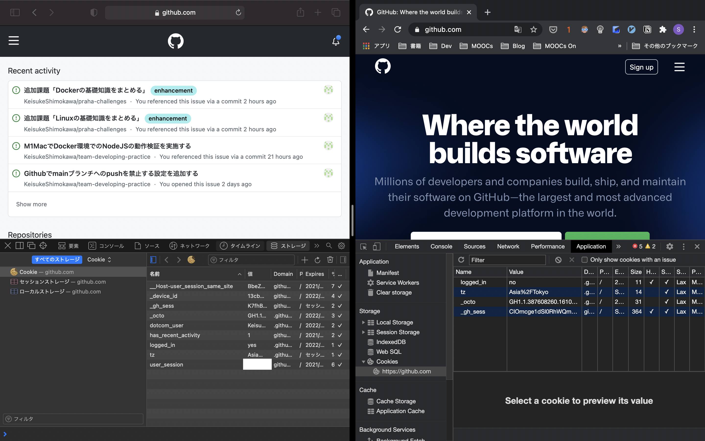
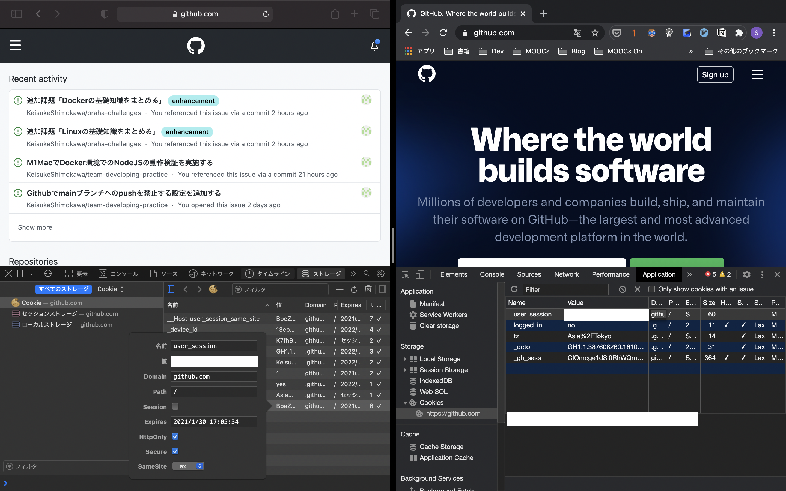
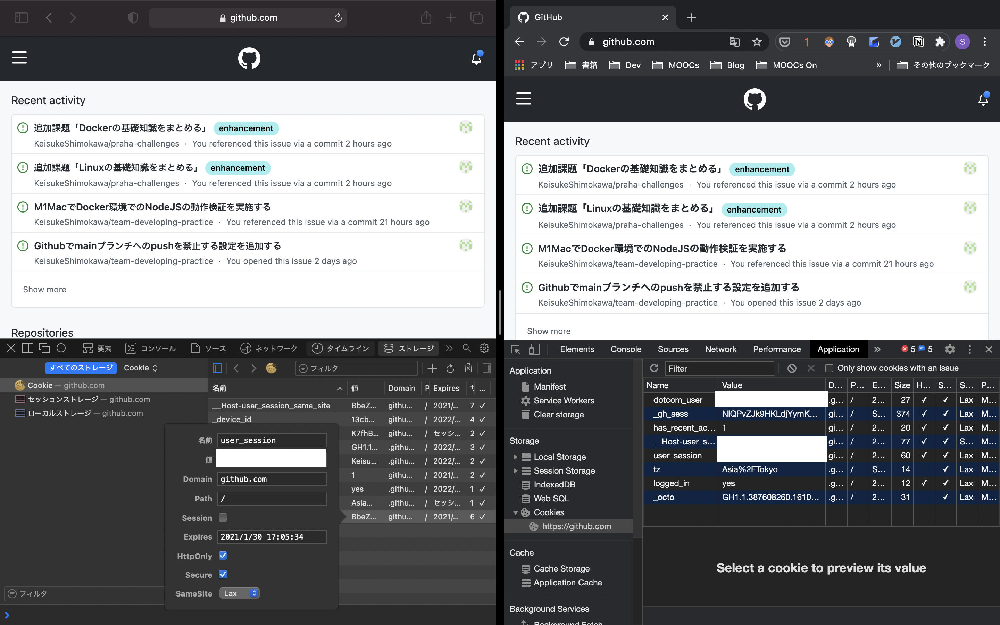

# 課題2

<!-- START doctoc generated TOC please keep comment here to allow auto update -->
<!-- DON'T EDIT THIS SECTION, INSTEAD RE-RUN doctoc TO UPDATE -->
<details>
<summary>Table of Contents</summary>

- [クイズ &#035;1](#%E3%82%AF%E3%82%A4%E3%82%BA-1)
- [クイズ &#035;2](#%E3%82%AF%E3%82%A4%E3%82%BA-2)
- [クイズ &#035;3](#%E3%82%AF%E3%82%A4%E3%82%BA-3)

</details>
<!-- END doctoc generated TOC please keep comment here to allow auto update -->

## クイズ #1

実際にユーザセッションを使用して、セッションハイジャックを試してみましょう。

- Step1
  - 検証のために2つのブラウザを使用する
    - Safari
    - Chrome
  - どちらとも[github.com](https://github.com)にアクセスする
  - Chromeから全てのCookieをクリアし、Githubのトップページが表示されていることを確認する
- Step2
  - Safariに登録されている **user_session** の値をコピーする
  - Chromeの検証ツールの`Application`タブから `github.com` ドメインに対応するCookieにコピーした値と対応する **user_session** を登録する
- Step3
  - ページを再ロードして、ユーザーページに遷移することを確認する

<details>
<summary>回答例</summary>

- Step1
  
- Step2
  
- Step3
  

</details>

## クイズ #2

Cookieに変わる機能として提案されている`Sec-HTTP-State`とは何でしょうか。

<details>
<summary>回答例</summary>

- Cookieの問題としては以下が挙げられる
  - Cookieへのアクセス
    - 現状では`document.cookie`を使用することで、デフォルトでCookieにアクセス可能
    - Cookieへの操作を防ぐためのA`HttpOnly`属性の導入率は8.31%（2018年8月時点）
  - Cookieの非セキュアなサイトへの送信
    - Cookieは`http://`などの非セキュアなサイトへデフォルトでCookieを送信する
    - 非セキュアなサイトにCookieを送信しないための`Secure`属性の導入率は7.85%（2018年8月時点）
- `Sec-HTTP-State`ヘッダ
  - 特徴はクライアント側から状態を管理するためのトークンを発行する点である
  - セキュアなオリジンにアクセスした際に、`256bit`のトークンを`Sec-HTTP-State`ヘッダに付与する
  - JavaScriptからこのトークンを操作することはできない
  - ブラウザは1つのオリジンに対して1つのトークンを発行できる
  - 非セキュアなサイトへのトークンは発行されない
  - `same-site`へのリクエストにのみ送信される
  - デフォルトではトークンの有効期限は1時間である
    - サーバ側やクライアント側からこの設定は変更可能
- デフォルトの挙動を変更することが可能
  - 例: 送信される境界を変更する
  
    ```js
    Sec-HTTP-State-Options: ..., delivery=cross-site, ...
    or
    Sec-HTTP-State-Options: ..., delivery=same-origin, ...
    ```
    
  - 例: 有効期限を変更する
  
    ```js
    Sec-HTTP-State-Options: ..., max-age=3600, ...
    
    Sec-HTTP-State-Options: ..., max-age=0, ...
    ```
    
    なおブラウザは状態変更を検知して、すぐさま反映することが可能
    
    ```js
    let resetChannel = new BroadcastChannel('http-state-reset'));
    resetChannel.onmessage = e => { /* Do exciting cleanup here. */ };
    ```

> 各属性値の導入率などはどうやって調べることができるのか?

参考資料

- [IFTF Draft](https://tools.ietf.org/html/draft-west-http-state-tokens-00)
- [Explainer: Tightening HTTP State Management](https://mikewest.github.io/http-state-tokens/)
- [https://github.com/mikewest/http-state-tokens](https://github.com/mikewest/http-state-tokens)
- [Cookieにかわる Sec-HTTP-State ヘッダの提案](https://asnokaze.hatenablog.com/entry/2018/08/15/023431)

</details>

## クイズ #3

Googleが提唱しているCookieの代替となる`Privacy Sandbox`とは何でしょうか。

<details>
<summary>回答例</summary>

- 背景
  - サードパーティクッキーは、Web上でユーザに対して最適な広告を表示したりするために使用されている
  - しかし、近年の個人情報保護への関心の高まりにより、その使用を各社で廃止するような取り組みが進められている。
- Privacy Sandbox
  - クッキーを削除することでプライバシーを保護することは可能ではあるが、広告の収入は減少してしまう
  - Googleはこの課題を解決するために、サードパーティクッキーの代替案となる「**Privacy Sandbox**」を提案している
  - 個人が特定されないようにユーザー情報を収集し、広告主がユーザーに対して広告を提供できる情報を提供する
  - 2年以外に廃止されるサードパーティクッキーに合わせて提案されている

参考資料

- [Building a more private web](https://www.blog.google/products/chrome/building-a-more-private-web/)
- [【解説】「サードパーティークッキーとマーケティングの 現在とこれから」クッキーの基本を理解して、未来を読み解く](https://media.kaizenplatform.com/n/n13f0904db164)
- [Privacy Sandboxはなにを語るのか](https://tech.plaid.co.jp/what-does-the-privacy-sandbox-tell-us/)

</details>

