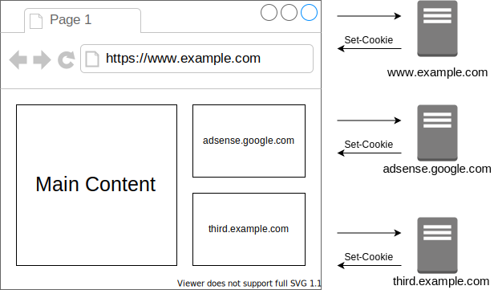

# サードパーティクッキーを理解する

<!-- START doctoc generated TOC please keep comment here to allow auto update -->
<!-- DON'T EDIT THIS SECTION, INSTEAD RE-RUN doctoc TO UPDATE -->

Table of Contents

- [課題1](#%E8%AA%B2%E9%A1%8C1)
  - [サードパーティクッキーとファーストパーティクッキーの違いは何か](#%E3%82%B5%E3%83%BC%E3%83%89%E3%83%91%E3%83%BC%E3%83%86%E3%82%A3%E3%82%AF%E3%83%83%E3%82%AD%E3%83%BC%E3%81%A8%E3%83%95%E3%82%A1%E3%83%BC%E3%82%B9%E3%83%88%E3%83%91%E3%83%BC%E3%83%86%E3%82%A3%E3%82%AF%E3%83%83%E3%82%AD%E3%83%BC%E3%81%AE%E9%81%95%E3%81%84%E3%81%AF%E4%BD%95%E3%81%8B)
  - [サードパーティクッキーを用いて、広告配信ネットワーク（Google Adsense など）はどのようにユーザーの訪問履歴を把握しているのか](#%E3%82%B5%E3%83%BC%E3%83%89%E3%83%91%E3%83%BC%E3%83%86%E3%82%A3%E3%82%AF%E3%83%83%E3%82%AD%E3%83%BC%E3%82%92%E7%94%A8%E3%81%84%E3%81%A6%E5%BA%83%E5%91%8A%E9%85%8D%E4%BF%A1%E3%83%8D%E3%83%83%E3%83%88%E3%83%AF%E3%83%BC%E3%82%AFgoogle-adsense-%E3%81%AA%E3%81%A9%E3%81%AF%E3%81%A9%E3%81%AE%E3%82%88%E3%81%86%E3%81%AB%E3%83%A6%E3%83%BC%E3%82%B6%E3%83%BC%E3%81%AE%E8%A8%AA%E5%95%8F%E5%B1%A5%E6%AD%B4%E3%82%92%E6%8A%8A%E6%8F%A1%E3%81%97%E3%81%A6%E3%81%84%E3%82%8B%E3%81%AE%E3%81%8B)
  - [サードパーティクッキーが生成される過程にはどのようなパターンが存在しているのか](#%E3%82%B5%E3%83%BC%E3%83%89%E3%83%91%E3%83%BC%E3%83%86%E3%82%A3%E3%82%AF%E3%83%83%E3%82%AD%E3%83%BC%E3%81%8C%E7%94%9F%E6%88%90%E3%81%95%E3%82%8C%E3%82%8B%E9%81%8E%E7%A8%8B%E3%81%AB%E3%81%AF%E3%81%A9%E3%81%AE%E3%82%88%E3%81%86%E3%81%AA%E3%83%91%E3%82%BF%E3%83%BC%E3%83%B3%E3%81%8C%E5%AD%98%E5%9C%A8%E3%81%97%E3%81%A6%E3%81%84%E3%82%8B%E3%81%AE%E3%81%8B)
  - [ブラウザごとのサードパーティクッキーの扱い方の違いはどのようなものでしょうか](#%E3%83%96%E3%83%A9%E3%82%A6%E3%82%B6%E3%81%94%E3%81%A8%E3%81%AE%E3%82%B5%E3%83%BC%E3%83%89%E3%83%91%E3%83%BC%E3%83%86%E3%82%A3%E3%82%AF%E3%83%83%E3%82%AD%E3%83%BC%E3%81%AE%E6%89%B1%E3%81%84%E6%96%B9%E3%81%AE%E9%81%95%E3%81%84%E3%81%AF%E3%81%A9%E3%81%AE%E3%82%88%E3%81%86%E3%81%AA%E3%82%82%E3%81%AE%E3%81%A7%E3%81%97%E3%82%87%E3%81%86%E3%81%8B)
  - [ポート番号が異なるクッキーはサードパーティクッキーに該当するのか](#%E3%83%9D%E3%83%BC%E3%83%88%E7%95%AA%E5%8F%B7%E3%81%8C%E7%95%B0%E3%81%AA%E3%82%8B%E3%82%AF%E3%83%83%E3%82%AD%E3%83%BC%E3%81%AF%E3%82%B5%E3%83%BC%E3%83%89%E3%83%91%E3%83%BC%E3%83%86%E3%82%A3%E3%82%AF%E3%83%83%E3%82%AD%E3%83%BC%E3%81%AB%E8%A9%B2%E5%BD%93%E3%81%99%E3%82%8B%E3%81%AE%E3%81%8B)
- [課題2](#%E8%AA%B2%E9%A1%8C2)

<!-- END doctoc generated TOC please keep comment here to allow auto update -->

## 課題1

### サードパーティクッキーとファーストパーティクッキーの違いは何か

Cookieの流れを振り返ってみると、サーバがクライアントへのレスポンスに対して `Set-Cookie` を使用してクライアントにCookieを送信し、クライアントから次のリクエストをサーバに送信する際に `Cookie` ヘッダを使用してCookieを送信できる。

つまりCookieとは、どこかのサイトに紐づいている情報である。

なおこの時のサイトとは、以下の組み合わせで表現されている。
（議論を簡単にするため、Schemeless-Same-Siteを考える。）

- [Public Suffix List]で定義されている **eTLD**
- **eTLD+1**

例えば以下の状況を考える。

この場合、3つのサイトに紐づくCookieは以下のように分類できる

- 1st-party cookie: `www.example.com` に紐づくCookie
- 3rd-party cookie: `adsense.google.com` に紐づくCookie
- 3rd-party cookie: `third.example.com` に紐づくCookie

これは [RFC6265bisの5.2.1](https://tools.ietf.org/html/draft-ietf-httpbis-rfc6265bis-07#section-5.2.1)で言及されている（厳密な定義は見当たらない）ように、ブラウザのアドレスバーに指定されているURLに対して、Cookieを分類することができる。

これが 1st-party cookie と 3rd-party cookie の違いである。

### サードパーティクッキーを用いて、広告配信ネットワーク（Google Adsense など）はどのようにユーザーの訪問履歴を把握しているのか

### サードパーティクッキーが生成される過程にはどのようなパターンが存在しているのか

### ブラウザごとのサードパーティクッキーの扱い方の違いはどのようなものでしょうか

### ポート番号が異なるクッキーはサードパーティクッキーに該当するのか

## 課題2

- ページの読み込み時に、ファーストパーティクッキーとサードパーティクッキーが設定されるWebサイトを構築する
- 仕様
  - ファーストパーティクッキーはHTTPSドメインから
  - サードパーティクッキーはHTTPSドメインから
  - httponly属性がついている
