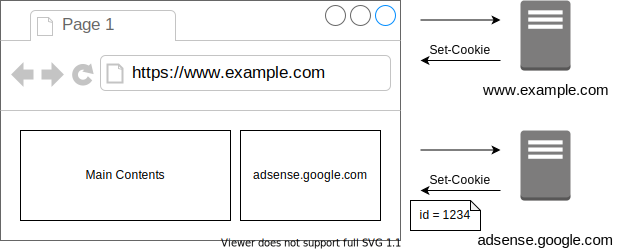

# サードパーティクッキーを理解する

<!-- START doctoc generated TOC please keep comment here to allow auto update -->
<!-- DON'T EDIT THIS SECTION, INSTEAD RE-RUN doctoc TO UPDATE -->

Table of Contents

- [課題1](#%E8%AA%B2%E9%A1%8C1)
  - [&#035;1 サードパーティクッキーとファーストパーティクッキーの違いは何か](#1-%E3%82%B5%E3%83%BC%E3%83%89%E3%83%91%E3%83%BC%E3%83%86%E3%82%A3%E3%82%AF%E3%83%83%E3%82%AD%E3%83%BC%E3%81%A8%E3%83%95%E3%82%A1%E3%83%BC%E3%82%B9%E3%83%88%E3%83%91%E3%83%BC%E3%83%86%E3%82%A3%E3%82%AF%E3%83%83%E3%82%AD%E3%83%BC%E3%81%AE%E9%81%95%E3%81%84%E3%81%AF%E4%BD%95%E3%81%8B)
  - [&#035;2 サードパーティクッキーを用いて、広告配信ネットワーク（Google Adsense など）はどのようにユーザーの訪問履歴を把握しているのか](#2-%E3%82%B5%E3%83%BC%E3%83%89%E3%83%91%E3%83%BC%E3%83%86%E3%82%A3%E3%82%AF%E3%83%83%E3%82%AD%E3%83%BC%E3%82%92%E7%94%A8%E3%81%84%E3%81%A6%E5%BA%83%E5%91%8A%E9%85%8D%E4%BF%A1%E3%83%8D%E3%83%83%E3%83%88%E3%83%AF%E3%83%BC%E3%82%AFgoogle-adsense-%E3%81%AA%E3%81%A9%E3%81%AF%E3%81%A9%E3%81%AE%E3%82%88%E3%81%86%E3%81%AB%E3%83%A6%E3%83%BC%E3%82%B6%E3%83%BC%E3%81%AE%E8%A8%AA%E5%95%8F%E5%B1%A5%E6%AD%B4%E3%82%92%E6%8A%8A%E6%8F%A1%E3%81%97%E3%81%A6%E3%81%84%E3%82%8B%E3%81%AE%E3%81%8B)
  - [&#035;3 サードパーティクッキーが生成される過程にはどのようなパターンが存在しているのか](#3-%E3%82%B5%E3%83%BC%E3%83%89%E3%83%91%E3%83%BC%E3%83%86%E3%82%A3%E3%82%AF%E3%83%83%E3%82%AD%E3%83%BC%E3%81%8C%E7%94%9F%E6%88%90%E3%81%95%E3%82%8C%E3%82%8B%E9%81%8E%E7%A8%8B%E3%81%AB%E3%81%AF%E3%81%A9%E3%81%AE%E3%82%88%E3%81%86%E3%81%AA%E3%83%91%E3%82%BF%E3%83%BC%E3%83%B3%E3%81%8C%E5%AD%98%E5%9C%A8%E3%81%97%E3%81%A6%E3%81%84%E3%82%8B%E3%81%AE%E3%81%8B)
  - [&#035;4 ブラウザごとのサードパーティクッキーの扱い方の違いはどのようなものでしょうか](#4-%E3%83%96%E3%83%A9%E3%82%A6%E3%82%B6%E3%81%94%E3%81%A8%E3%81%AE%E3%82%B5%E3%83%BC%E3%83%89%E3%83%91%E3%83%BC%E3%83%86%E3%82%A3%E3%82%AF%E3%83%83%E3%82%AD%E3%83%BC%E3%81%AE%E6%89%B1%E3%81%84%E6%96%B9%E3%81%AE%E9%81%95%E3%81%84%E3%81%AF%E3%81%A9%E3%81%AE%E3%82%88%E3%81%86%E3%81%AA%E3%82%82%E3%81%AE%E3%81%A7%E3%81%97%E3%82%87%E3%81%86%E3%81%8B)
  - [&#035;5 ポート番号が異なるクッキーはサードパーティクッキーに該当するのか](#5-%E3%83%9D%E3%83%BC%E3%83%88%E7%95%AA%E5%8F%B7%E3%81%8C%E7%95%B0%E3%81%AA%E3%82%8B%E3%82%AF%E3%83%83%E3%82%AD%E3%83%BC%E3%81%AF%E3%82%B5%E3%83%BC%E3%83%89%E3%83%91%E3%83%BC%E3%83%86%E3%82%A3%E3%82%AF%E3%83%83%E3%82%AD%E3%83%BC%E3%81%AB%E8%A9%B2%E5%BD%93%E3%81%99%E3%82%8B%E3%81%AE%E3%81%8B)
- [課題2](#%E8%AA%B2%E9%A1%8C2)

<!-- END doctoc generated TOC please keep comment here to allow auto update -->

## 課題1

### #1 サードパーティクッキーとファーストパーティクッキーの違いは何か

Cookieの流れを振り返ってみると、サーバがクライアントへのレスポンスに対して `Set-Cookie` を使用してクライアントにCookieを送信し、クライアントから次のリクエストをサーバに送信する際に `Cookie` ヘッダを使用してCookieを送信できる。

つまりCookieとは、どこかのサイトに紐づいている情報である。

なおこの時のサイトとは、以下の組み合わせで表現されている。
（議論を簡単にするため、Schemeless-Same-Siteを考える。）

- [Public Suffix List]で定義されている **eTLD**
- **eTLD+1**

例えば以下の状況を考える。

この場合、3つのサイトに紐づくCookieは以下のように分類できる

- 1st-party cookie: `www.example.com` に紐づくCookie
- 3rd-party cookie: `adsense.google.com` に紐づくCookie
- 3rd-party cookie: `third.example.com` に紐づくCookie

これは [RFC6265bisの5.2.1](https://tools.ietf.org/html/draft-ietf-httpbis-rfc6265bis-07#section-5.2.1)で言及されている（厳密な定義は見当たらない）ように、ブラウザのアドレスバーに指定されているURLに対して、Cookieを分類することができる。

これが 1st-party cookie と 3rd-party cookie の違いである。

ただし `Domain` 属性が `example.com` と指定されていた場合、 Cookie の送信先ホストとしては全てのサブドメインも含まれるため、 `www.example.com` にも `third.example.com` にもCookie が送信される。

### #2 サードパーティクッキーを用いて、広告配信ネットワーク（Google Adsense など）はどのようにユーザーの訪問履歴を把握しているのか

Google AdSenseでは、Cookie が設定された範囲のリクエストであれば、どのような場所から発行したリクエストであっても付与されてしまう性質を使用して、ユーザーの訪問履歴を把握している。

例えば、以下のように `www.example.com` にアクセスして取得したページ内に、 `adsense.google.com` から発行される広告バナーが存在すると、ブラウザは対象のサーバにリクエストを送信する。
そして `adsense.google.com` は、ブラウザを識別するための ID を Cookie に設定したうえでレスポンスを返す。

これでユーザーがほかのページをアクセスしたとしても、そのページ内に `adsense.google.com` が提供する広告が存在していた場合、ブラウザからドメインに紐づくCookieが送信され、サーバはユーザーの訪問履歴を追跡することが可能である。

実際に Google Analytics では、 [gtag.js](https://developers.google.com/analytics/devguides/collection/gtagjs?hl=ja) 、 [analytics.js](https://developers.google.com/analytics/devguides/collection/analyticsjs?hl=ja) 、 [ga.js](https://developers.google.com/analytics/devguides/collection/gajs?hl=ja) の3種類の JavaScript ライブラリを使用して、ユーザーのウェブサイトの利用状況を測定している。

よく見かけるであろう Cookie の代表例は以下である。

| 名称                 | 有効期限 | 内容                                                                                                                                  | 
| -------------------- | -------- | ------------------------------------------------------------------------------------------------------------------------------------- | 
| `_ga`                | 2年      | ユーザーを区別するために使用する                                                                                                      | 
| `_gid`               | 24時間   | ユーザーを区別するために使用する                                                                                                      | 
| `_gat`               | 1分      | リクエスト率を抑制するために使用する Googleタグマネージャーから導入された場合は `_dc_gtm_<property_id>` となる                     | 
| `_gac_<property_id>` | 90日     | ユーザーのキャンペーン関連情報を含む オプトアウトしない限り、Google広告webサイトのコンバージョンタグでこのCookie情報が読み取られる | 
| `__utma`             | 2年      | ユーザーとセッションを区別するために使用する                                                                                          | 

参考資料

- [AdSense が Cookie を使用する仕組み](https://support.google.com/adsense/answer/7549925?hl=ja)
- [GOOGLE による COOKIE の利用方法](https://policies.google.com/technologies/cookies#types-of-cookies)
- [Google アナリティクスによるウェブサイトでの Cookie の使用](https://developers.google.com/analytics/devguides/collection/analyticsjs/cookie-usage?hl=ja)

### #3 サードパーティクッキーが生成される過程にはどのようなパターンが存在しているのか

そもそも Cookie の値を設定する方法は2つ存在している。

- ブラウザの `document.cookie` を使用する
- サーバがブラウザに対して `Set-Cookie` ヘッダを指定する

HTTPリクエストを発行すれば、サーバ側から Cookie を設定することは可能（ブラウザはブロックすることが可能）であるため、様々なパターンで Cookie を付与することはできる。

そのうちよくありそうなユースケースは以下である。

1. `<iframe>`を使ったコンテンツ配信
  - 動機としては以下のような可能性がある
    - 外部サイトのコンテンツを自身のサイトでも提供したい場合
    - Twitter や Facebook へのリンクや いいね などの機能を自身のサイトでも提供したい
    - Google Calendar のようなウィジェットを表示したい
  - 実験
    - 自身で構築したサイトにTweetを埋め込む
    - [embed-twitter](./embed-twitter) に配置している `index.html` を [Live Server](https://marketplace.visualstudio.com/items?itemName=ritwickdey.LiveServer) で起動して  Third-party Context としてリクエストを送信した
    - Network タブから確認すると Third-Party Cookieが付与されていることがわかる。

      

2. 安全ではないリクエストの送信
   - サーバのリソースの状態を変化させてしまうリクエストが、安全ではないリクエストである
     - 具体的な考え方は [RFC7231 4.2.1 Same Methods](https://tools.ietf.org/html/rfc7231#section-4.2.1) に記載されている
   - こちらもリクエストに対して HTTP Cookie を付与することで Third-Party Cookie を生成している
   - 具体的なユースケースとしては、 `SameSite=lax` の場合でありPOSTリクエストなどで Cookie が送信されない状況で、リダイレクトを行うことでブラウザにGETリクエストを発行させて、 Third-Party Cookie を送信するといったものである

3. リモートリソースへのアクセス
  - あるページから、他のドメインに対して画像（``）をリクエストしたり、スクリプト（`<script>`）をリクエストすると、Third-Party Cookie が送信される。
  - これはユーザの嗜好に合わせて配信コンテンツを決定する場合などで使用されている
  - 注意点
    - `<script>`で呼び出した JavaScript から `document.cookie` を使用して Cookie を生成した場合、これはFirst-Party Cookie として保存される
  - 実験
    - [request-script](./request-script) で ngrok でHTTPS化させたサービスから配信されている [script.js](./request-script/third-script/script.js) を読み込んでみる
    - 結果としてブラウザに保存された Cookie の Domain が外部リソースから読み込んでいるにもかかわらず、確かに異なっていることがわかる。

      

参考資料

- [SameSite Cookie Recipes](https://web.dev/samesite-cookie-recipes/)
- [A practical, Complete Tutorial on HTTP cookies](https://www.valentinog.com/blog/cookies/)

### #4 ブラウザごとのサードパーティクッキーの扱い方の違いはどのようなものでしょうか

| ブラウザ | 対応                                                                                                                                                                                                                                                                                                                                                         | 
| -------- | ------------------------------------------------------------------------------------------------------------------------------------------------------------------------------------------------------------------------------------------------------------------------------------------------------------------------------------------------------------ | 
| Chrome   | サードパーティクッキーはデフォルトでは **許可** する  サードパーティクッキーをブロックしたい場合は`SameSite`属性を利用する必要がある  また2022年にサードパーティクッキーを廃止する予定であり、代替機能としてPrivacy Sandboxを提案している  ただPrivacy Sandboxを導入することで広告業界においてGoogleがより力を強めるのではないかという懸念もある | 
| Firefox  | サードパーティクッキーはデフォルトで **ブロック** する  2019年に導入した Enhanced Tracking Protection機能を活用している。                                                                                                                                                                                                                                    | 
| Safari   | サードパーティクッキーはデフォルトで **ブロック** する  2017年に導入したITP（Intelligent Tracking Prevention）から始まり、クッキーの制限を段階的に上げている。                                                                                                                                                                                               | 

参考資料

- [最新のブラウザで変わるCookieの取り扱いやPrivacyの考え方](https://speakerdeck.com/yosuke_furukawa/zui-xin-falseburauzadebian-warucookiefalsequ-rixi-iyaprivacyfalsekao-efang)
- [Privacy Sandboxの懸念事項: 5.327](https://assets.publishing.service.gov.uk/media/5fa557668fa8f5788db46efc/Final_report_Digital_ALT_TEXT.pdf)
- [[Chromium Blog] Building a more private web: A path towards making third party cookies obsolete](https://blog.chromium.org/2020/01/building-more-private-web-path-towards.html)
- [[InfoQ] Safari Blocks Third-Party Cookies by Default](https://www.infoq.com/news/2020/04/safari-third-party-cookies-block/)
- [[Mozilla Blog] Today’s Firefox Blocks Third-Party Tracking Cookies and Cryptomining by Default](https://blog.mozilla.org/blog/2019/09/03/todays-firefox-blocks-third-party-tracking-cookies-and-cryptomining-by-default/)

### #5 ポート番号が異なるクッキーはサードパーティクッキーに該当するのか

- Cookieはポート番号による分離は行わない
- 例えば `http://localhost:8080` のサービスで設定されたCookieと、 `http://localhost:8090` のサービスで設定されたCookieはお互いにアクセスすることが可能である。

参考資料

- [[RFC6265bis] 8.5 Weak Confidentiality](https://tools.ietf.org/html/draft-ietf-httpbis-rfc6265bis-07#section-8.5)

## 課題2

- ページの読み込み時に、ファーストパーティクッキーとサードパーティクッキーが設定されるWebサイトを構築する
- 仕様
  - ファーストパーティクッキーはHTTPSドメインから
  - サードパーティクッキーはHTTPSドメインから
  - httponly属性がついている
- 実装
  - [third-party cookie](./third-party-cookie)
- 結果
  - 以下の画像で示しているように、ファーストパーティクッキーの設定と、ngrok で HTTPS化させたサードパーティクッキーの設定が正しく実行されていることがわかる

    

なお課題では画像を読み込む際にサードパーティクッキーを設定したが、他の方法でもサードパーティクッキーの設定を試した。

その際の証跡は [expreriment-cookie](./experiment-cookie) で実施している。