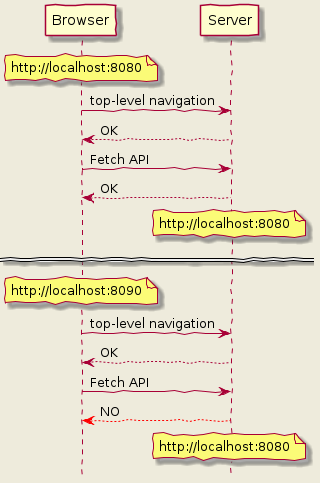
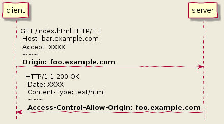
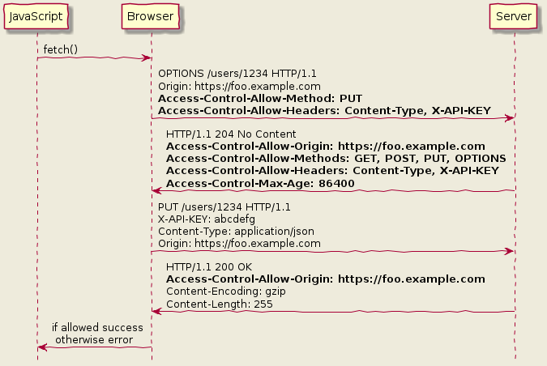

# CORS を理解する

<!-- START doctoc generated TOC please keep comment here to allow auto update -->
<!-- DON'T EDIT THIS SECTION, INSTEAD RE-RUN doctoc TO UPDATE -->
<details>
<summary>Table of Contents</summary>

- [課題 1「CORS」の仕組み](#%E8%AA%B2%E9%A1%8C-1cors%E3%81%AE%E4%BB%95%E7%B5%84%E3%81%BF)
  - [&#035;1 Same Origin Policy (SOP) とは何か](#1-same-origin-policy-sop-%E3%81%A8%E3%81%AF%E4%BD%95%E3%81%8B)
  - [&#035;2 Cross Origin Resource Sharing (CORS) とは何か](#2-cross-origin-resource-sharing-cors-%E3%81%A8%E3%81%AF%E4%BD%95%E3%81%8B)
  - [&#035;3 Access-Control-Allow-XXX による SOP の回避方法](#3-access-control-allow-xxx-%E3%81%AB%E3%82%88%E3%82%8B-sop-%E3%81%AE%E5%9B%9E%E9%81%BF%E6%96%B9%E6%B3%95)
  - [&#035;4 Simple Request と Preflight Request とは何か](#4-simple-request-%E3%81%A8-preflight-request-%E3%81%A8%E3%81%AF%E4%BD%95%E3%81%8B)
  - [&#035;5 CORS で認証情報を渡す方法](#5-cors-%E3%81%A7%E8%AA%8D%E8%A8%BC%E6%83%85%E5%A0%B1%E3%82%92%E6%B8%A1%E3%81%99%E6%96%B9%E6%B3%95)
  - [#6 `Access-Control-Allow-Origin: "*"` の危険性](#6-access-control-allow-origin--%E3%81%AE%E5%8D%B1%E9%99%BA%E6%80%A7)
- [課題 2 クイズ](#%E8%AA%B2%E9%A1%8C-2-%E3%82%AF%E3%82%A4%E3%82%BA)
- [課題 3 CORS を許可するサーバの構築](#%E8%AA%B2%E9%A1%8C-3-cors-%E3%82%92%E8%A8%B1%E5%8F%AF%E3%81%99%E3%82%8B%E3%82%B5%E3%83%BC%E3%83%90%E3%81%AE%E6%A7%8B%E7%AF%89)
- [課題 4 CURL でプリフライトリクエストの送信実験](#%E8%AA%B2%E9%A1%8C-4-curl-%E3%81%A7%E3%83%97%E3%83%AA%E3%83%95%E3%83%A9%E3%82%A4%E3%83%88%E3%83%AA%E3%82%AF%E3%82%A8%E3%82%B9%E3%83%88%E3%81%AE%E9%80%81%E4%BF%A1%E5%AE%9F%E9%A8%93)

</details>
<!-- END doctoc generated TOC please keep comment here to allow auto update -->

## 課題 1「CORS」の仕組み

> 「**preflight request**」、「**simple request**」、「**Access-Control-Allow-Origin**」の単語を使ってCORSの仕組みを説明せよ

こちらの課題に対しては、内容をまとめるために以下から順を追って説明していく。

---

### #1 Same Origin Policy (SOP) とは何か

Web 上のあるサイト A から異なるサイト B のリソースを呼び出す行為を制限なく許可してしまうと、重要なデータを盗み出したり、`<iframe>`を通じて自由に DOM を書き換えられてしまう可能性が存在している。

こうした脅威から Web を保護するために、ブラウザは **Origin** という境界を設定し、この Origin を超えるようなアクセスに対して制限を設けている。

この Origin は **スキーム・ホスト名・ポート番号** の 3 つの組み合わせで構成されている。
（定義は [RFC6454 Section 3.2 Origin](https://tools.ietf.org/html/rfc6454#section-3.2) に記載されている。）

例えば `https://www.example.com` を例に以下の URL が同じ Origin かどうか見てみる。

| Origin                               | 同じ？                 |
| :----------------------------------- | :--------------------- |
| `https://api.example.com`            | 異なる（ホスト名）     |
| `http://www.example.com`             | 異なる（スキーム）     |
| `https://www.example.com:8080`       | 異なる（ポスト番号）   |
| `https://www.example.com/index.html` | 同じ（パスは関係無い） |

この Origin に従って、ブラウザは異なる Origin からきたコンテンツに対して様々な制限を設けている。

- 異なる Origin へのブラウザ内アクセスの禁止
- ネットワーク越しのアクセスの禁止

実際にどのような制限を行なっているのか、適当に HTML ファイルを作成して挙動を確認する。

- 実験内容
  1. `<form>` タグを使用して、Same-Origin と Cross-Origin の両方へアクセス
  2. `fetch` を使用して、Same-Origin と Cross-Origin の両方へアクセス
- 結果
  - [./no-cors](./no-cors) でSOPの挙動を確認した
    1. `<form>` の場合は、Cross-Originであってもページ遷移可能
    2. `fetch` の場合は、Cross-Originへのアクセスは拒否される

        

  - つまり以下のような挙動になっている
  
    

---

### #2 Cross Origin Resource Sharing (CORS) とは何か

Cross Origin Resource Sharing (CORS) とは、特定の HTTP ヘッダを使用することで、ブラウザが保護している異なる Origin のリソースへのアクセスに対して、サーバ側はブラウザにアクセス権を与える仕組みである。


SOP を回避するための CORS 設定は、サーバ側で実装する必要がある。

では実際にその具体例を見ていく。

---

### #3 Access-Control-Allow-XXX による SOP の回避方法

具体的にどのような HTTP ヘッダが存在しているのかは、[[Fetch Standard] Section 3.2 CORS protocol](https://fetch.spec.whatwg.org/#http-cors-protocol) に記載されている。

これらの HTTP ヘッダを使用することで、サーバはリクエストに対して以下のような確認を行うことができる。

- リクエストの送信元を受け入れるかどうか
- リクエストの HTTP メソッドを受け入れるかどうか
- リクエストの HTTP ヘッダを受け入れるかどうか
- リクエストの 認証情報を受け入れるかどうか

では、ブラウザが現在開いている `https://foo.example.com` のリソースから、 `https://bar.example.com` に対して以下の条件にあうリクエストを送信しようとしている状況を考える。

- クライアントが送信したいリクエスト
  - `https://bar.example.com/index.html` に対する `GET`　リクエスト

このとき、CORS を実装しているサーバは以下のようなリクエストを返す。



重要な情報は `Access-Control-Allow-Origin: foo.example.com` である。

この HTTP ヘッダをブラウザに通知することで、ブラウザはサーバ側から自身が送信している Origin から、サーバ側のリソースに対するアクセス権を得る事ができる。

> ただし最初の実験で見たように、昔から実装されている `top-level navigation` などでは関係ない。

サーバからブラウザに送信できる CORS 設定を行うためのヘッダは以下になる。

| ヘッダ                             | 内容                                                                                                                                                                                                                                                                                              |
| ---------------------------------- | ------------------------------------------------------------------------------------------------------------------------------------------------------------------------------------------------------------------------------------------------------------------------------------------------- |
| `Access-Control-Allow-Origin`      | サーバ側のリソースにアクセスできる `Origin` を指定する。<br><br>任意の `Origin` (`*`) を設定することも可能ではあるが、SOP によるセキュリティを緩めてしまうことになるので注意が必要である。                                                                                                        |
| `Access-Control-Allow-Methods`     | サーバ側が許可する HTTP メソッドを指定する。                                                                                                                                                                                                                                                      |
| `Access-Control-Allow-Headers`     | サーバ側が許可する HTTP ヘッダを指定する。<br><br>JSON を送信する場合の `Content-Type` やそのほかのカスタムヘッダなどをよく設定する。                                                                                                                                                             |
| `Access-Control-Allow-Credentials` | 資格情報つきのリクエストを許可するかどうか決定する。<br><br>Simple Request の場合では、リソースへのレスポンスにこのヘッダが含まれていない場合は、ブラウザはレスポンスを無視する。<br><br>Preflight Request の場合では、後続の本来送信したいリクエストに資格情報を使用していいかどうかを通知する。 |
| `Access-Control-Max-Age`           | Preflight Request の結果をどの程度の時間キャッシュするのか決定する。<br><br>単位は **秒** である                                                                                                                                                                                                  |
| `Access-Control-Expose-Headers`    | クライアントに対して、サーバ側が許可している HTTP ヘッダを公開する。<br><br>デフォルトでは 7 つのヘッダが公開される。                                                                                                                                                                             |

---

### #4 Simple Request と Preflight Request とは何か

SOP によるリソース分離と、CORS による SOP の緩和はブラウザにはじめから実装されていたわけではない。

そのため異なる Origin に対する全てのリクエストに対して SOP を適用すると問題が発生してしまう。

例えば昔のサイトでは、異なるサイトへのアクセスとして `<a>` タグによる GET リクエストを用いたページ遷移や、 `<form>` タグによる POST リクエストですら、SOP 制限によりリクエストが拒否されてしまう。

このため、上記のような昔から取り扱うことのできるリクエストに対しては、SOP を適用せずに CORS が可能な **Simple Request** として取り扱い、それ以外のリクエストは単純ではないリクエストとして、CORS を行うための準備である **Preflight Request** を送信する。

実際に単純なリクエストは以下のように分類される。
（詳細は[[Fetch Standard] Section 2.2.2](https://fetch.spec.whatwg.org/#terminology-headers) を参照する。）

|                  | 単純                                                                                                                                                                                                                            | 単純ではない                                               |
| ---------------- | ------------------------------------------------------------------------------------------------------------------------------------------------------------------------------------------------------------------------------- | ---------------------------------------------------------- |
| HTTP メソッド    | GET、HEAD、POST                                                                                                                                                                                                                 | ⇦ 以外の HTTP メソッド<br><br>PUT、PATCH、DELETE、などなど |
| リクエストヘッダ | Accept<br>Accept-Encoding<br>Accept-Language<br>Content-Type（条件あり）<br><br>（詳細は Fetch 仕様書の「CORS リクエストセーフリクエストヘッダー」を参照）<br>（https://fetch.spec.whatwg.org/#cors-safelisted-request-header） | ⇦ 以外の HTTP ヘッダ                                       |
| Content-Type     | application/x-www-form-urlencoded<br>multipart/form-data<br>text/plain                                                                                                                                                          | ⇦ 以外の Content-Type<br><br>application/json など         |
| ReadableStream   | ON                                                                                                                                                                                                                              | OFF                                                        |
| XMLHttpRequest   | XMLHttpRequestUpload にイベントリスナーが登録されていないこと                                                                                                                                                                   |                                                            |

単純ではないリクエストを送信する際に利用する **Preflight Request** とは、実際のリクエストをサーバに送信する前に、 `OPTIONS`メソッドと特定の HTTP メソッドを使用して、サーバが実際のリクエストを許可しているのかどうか確かめるためのリクエストである。

例えば以下の条件に従うリクエストを `Fetch API` で送信する場合、 Preflight Request と実際のリクエストとを合わせて、図のようなリクエストとレスポンスがやり取りされる。

- リクエスト
  - 送信元は `https://foo.example.com`
  - `PUT` メソッド
  - リソースは `https://bar.example.com/users/1234`
  - `Content-Type` はjson
  - カスタムヘッダとして `X-API-KEY` を送信



上記の挙動を見ると、 Preflight Request を送信する際に `OPTIONS` メソッドを送信しており、またサーバに実際のリクエストで使用するHTTPメソッドとHTTPヘッダを送信している。

|ヘッダ|内容|
|:--|:--|
|`Access-Control-Request-Method`|後続のリクエストで送信するHTTPメソッドをサーバに通知する|
|`Access-Control-Request-Headers`|後続のリクエストで送信するHTTPヘッダをサーバに通知する|

これが Preflight Request の動作である。

---

### #5 CORS で認証情報を渡す方法

Cookieなどの認証情報は、デフォルトでは `Fetch API` や `XMLHttpRequest` からは送信することができず、必ず明示的に設定を追加する必要がある。

- `Fetch API` での送信

  ```js
  const url = "https://www.example.com/XXX"

  fetch(URL, {
    mode: "cors",
    credentials: "include"
  })
  ```

- `XMLHttpRequest` での送信

  ```js
  const url = "https://www.example.com/XXX"

  const xhr = new XMLHttpRequest();
  xhr.withCredentials = true;
  xhr.open("GET", url);
  xhr.send();
  ```

サーバ側は、認証情報が渡された場合には特定のHTTPヘッダを返す必要がある。
以下がその具体例である。

```bash
HTTP/1.1 200 OK
Access-Control-Allow-Origin: https://client.example.com
Access-Control-Allow-Credentials: true
```

ただし、 `Access-Control-Allow-Credentials` ヘッダを使用する場合は、 `Access-Control-Allow-Origin` に全ての Origin をあらわすワイルドカード（`*`）は設定できない点に注意する必要がある。

---

### #6 `Access-Control-Allow-Origin: "*"` の危険性

たいていの場合、 `Access-Control-Allow-Origin` に対してワイルドカード（`"*"`）を設定していても、Cookieなどの機密情報が盗み出されることはない。

しかしURL自体に機密情報が含まれている場合、攻撃される可能性はある。基本的にはこのヘッダはドメイン全体に適用せずに、クロスドメインアクセスが必要な特定のURLのみに使用することが重要である。

- [[OWASP] Cross Origin Resource Sharing](https://cheatsheetseries.owasp.org/cheatsheets/HTML5_Security_Cheat_Sheet.html#cross-origin-resource-sharing)
- [Is Access-Control-Allow-Origin: * insecure?](https://advancedweb.hu/is-access-control-allow-origin-star-insecure/)

## 課題 2 クイズ

- [クイズ](./quiz.md)

## 課題 3 CORS を許可するサーバの構築

以下の条件に従うモックを作成する。

- 実験内容
  - 特定の Origin からのPOSTリクエストを許可
  - それ以外の Origin からのPOSTリクエストはアクセス制限される
  - 単純なリクエストの時には Preflight Request が送信されない
  - 単純ではないリクエストの際には Preflight Request が送信される
- 実装
  - [./cors](./cors)
  
## 課題 4 CURL でプリフライトリクエストの送信実験

以下の curl コマンドを送信したところ、CORS の制約には引っかからなかった。

```bash
$ curl http://localhost:8080 \
  --header "Content-Type: application/json" \
  --data '{"username": "preflight"}' \
  --verbose
```

これはあくまでも SOP や CORS はブラウザに実装されている機能だからである。
