# CORSを理解する

## 課題1「CORS」の仕組み

CORSを理解するために、以下の解説を行う。

1. Same Origin Policy (SOP) とは何か
2. Cross Origin Resource Sharing (CORS) とは何か
3. Access-Control-Allow-XXX によるSOPの回避方法
4. Simple Request と Preflight Request とは何か
5. CORS を実装していないサーバへの　Simple Request へのアクセス
6. CORS で認証情報を渡す方法

### #1 Same Origin Policy (SOP) とは何か

Web上のあるサイトAから異なるサイトBのリソースを呼び出す行為を制限なく許可してしまうと、重要なデータを盗み出したり、`<iframe>`を通じて自由にDOMを書き換えられてしまう可能性が存在している。

こうした脅威からWebを保護するために、ブラウザは **Origin** という境界を設定し、この Origin を超えるようなアクセスに対して制限を設けている。

この Origin は **スキーム・ホスト名・ポート番号** の3つの組み合わせで構成されている。
（定義は [RFC6454 Section 3.2 Origin](https://tools.ietf.org/html/rfc6454#section-3.2) に記載されている。）

例えば `https://www.example.com` を例に以下のURLが同じ Origin かどうか見てみる。

| Origin                               | 同じ？            |
|:-------------------------------------|:---------------|
| `https://api.example.com`            | 異なる（ホスト名）     |
| `http://www.example.com`             | 異なる（スキーム）      |
| `https://www.example.com:8080`       | 異なる（ポスト番号）   |
| `https://www.example.com/index.html` | 同じ（パスは関係無い） |

この Origin に従って、ブラウザは異なる Origin からきたコンテンツに対して様々な制限を設けている。

- 異なる Origin へのブラウザ内アクセスの禁止
- ネットワーク越しのアクセスの禁止

実際にどのような制限を行なっているのか、適当にHTMLファイルを作成して挙動を確認する。

- `<iframe>`　を活用した異なる Origin に対するブラウザ内アクセス
- `fetch` を活用した異なる Origin に対するネットワーク越しのアクセス
- `<form>` タグを使用した異なる Origin に対するネットワーク越しのアクセス

### #2 Cross Origin Resource Sharing (CORS) とは何か

Cross Origin Resource Sharing (CORS) とは、特定のHTTPヘッダを使用することで、ブラウザが保護している異なる Origin のリソースへのアクセスに対して、サーバ側はブラウザにアクセス権を与える仕組みである。

SOPを回避するためのCORS設定は、サーバ側で実装する必要がある。

では実際にその具体例を見ていく。

### #3 Access-Control-Allow-XXX によるSOPの回避方法

具体的にどのようなHTTPヘッダが存在しているのかは、[[Fetch Standard] Section 3.2 CORS protocol](https://fetch.spec.whatwg.org/#http-cors-protocol) に記載されている。

基本的な考え方としては、サーバがリクエストを受け取った時に、リクエスト元のURLを信頼できるものとして判断するのか、リクエストが実行しようとしているHTTPメソッドを許可するのか、リクエストのヘッダを許可するのか、といったサーバ側視点での制約である。

では、ブラウザが現在開いている `https://foo.example.com` のリソースから、 `https://bar.example.com` に対して以下の条件にあうリクエストを送信しようとしている状況を考える。

- クライアントが送信したいリクエスト
  - `https://bar.example.com/index.html` に対する `GET`　リクエスト

このとき、CORSを実装しているサーバは以下のようなリクエストを返す。

重要な情報は `Access-Control-Allow-Origin: foo.example.com` である。
このHTTPヘッダをブラウザに通知することで、ブラウザはサーバ側から自身が送信している Origin から、サーバ側のリソースに対するアクセス権を得る事ができる。

サーバからブラウザに送信できるCORS設定を行うためのヘッダは以下になる。

| ヘッダ                             | 内容                                                                                                                                                                                                                                                                                              | 
| ---------------------------------- | ------------------------------------------------------------------------------------------------------------------------------------------------------------------------------------------------------------------------------------------------------------------------------------------------- | 
| `Access-Control-Allow-Origin`      | サーバ側のリソースにアクセスできる `Origin` を指定する。  任意の `Origin` (`*`) を設定することも可能ではあるが、SOPによるセキュリティを緩めてしまうことになるので注意が必要である。                                                                                                         | 
| `Access-Control-Allow-Methods`     | サーバ側が許可するHTTPメソッドを指定する。                                                                                                                                                                                                                                                        | 
| `Access-Control-Allow-Headers`     | サーバ側が許可するHTTPヘッダを指定する。  JSON を送信する場合の `Content-Type` やそのほかのカスタムヘッダなどをよく設定する。                                                                                                                                                               | 
| `Access-Control-Allow-Credentials` | 資格情報つきのリクエストを許可するかどうか決定する。  Simple Request の場合では、リソースへのレスポンスにこのヘッダが含まれていない場合は、ブラウザはレスポンスを無視する。  Preflight Request の場合では、後続の本来送信したいリクエストに資格情報を使用していいかどうかを通知する。 | 
| `Access-Control-Max-Age`           | Preflight Request の結果をどの程度の時間キャッシュするのか決定する。  単位は **秒** である                                                                                                                                                                                                  | 
| `Access-Control-Expose-Headers`    | クライアントに対して、サーバ側が許可しているHTTPヘッダを公開する。  デフォルトでは7つのヘッダが公開される。                                                                                                                                                                                 | 

### #4 Simple Request と Preflight Request とは何か

SOPによるリソース分離と、CORSによるSOPの緩和はブラウザにはじめから実装されていたわけではない。

そのため異なる Origin に対する全てのリクエストに対してSOPを適用すると問題が発生してしまう。

例えば昔のサイトでは、異なるサイトへのアクセスとして `<a>` タグによるGETリクエストを用いたページ遷移や、 `<form>` タグによるPOSTリクエストですら、SOP制限によりリクエストが拒否されてしまう。

このため、上記のような昔から取り扱うことのできるリクエストに対しては、SOPを適用せずにCORSが可能な **Simple Request** として取り扱い、それ以外のリクエストは単純ではないリクエストとして、CORSを行うための準備である **Preflight Request** を送信する。 

実際に単純なリクエストは以下のように分類される。
（詳細は[[Fetch Standard] Section 2.2.2](https://fetch.spec.whatwg.org/#terminology-headers) を参照する。）

|                  | 単純                                                                                                                                                                                                                          | 単純ではない                                             | 
| ---------------- | ----------------------------------------------------------------------------------------------------------------------------------------------------------------------------------------------------------------------------- | -------------------------------------------------------- | 
| HTTPメソッド     | GET、HEAD、POST                                                                                                                                                                                                               | ⇦以外のHTTPメソッド  PUT、PATCH、DELETE、などなど | 
| リクエストヘッダ | Accept Accept-Encoding Accept-Language Content-Type（条件あり）  （詳細はFetch 仕様書の「CORSリクエストセーフリクエストヘッダー」を参照） （https://fetch.spec.whatwg.org/#cors-safelisted-request-header） | ⇦以外のHTTPヘッダ                                       | 
| Content-Type     | application/x-www-form-urlencoded multipart/form-data text/plain                                                                                                                                                        | ⇦以外のContent-Type  application/json など        | 
| ReadableStream   | ON                                                                                                                                                                                                                            | OFF                                                      | 
| XMLHttpRequest   | XMLHttpRequestUploadにイベントリスナーが登録されていないこと                                                                                                                                                                  |                                                          | 

単純ではないリクエストを送信する際に利用する **Preflight Request** とは、実際のリクエストをサーバに送信する前に、 `OPTIONS`メソッドと特定のHTTPメソッドを使用して、サーバが実際のリクエストを許可しているのかどうか確かめるためのリクエストである。

### #5 CORS を実装していないサーバへの　Simple Request へのアクセス

### #6 CORS で認証情報を渡す方法

## 課題2 クイズ

## 課題3 CORSを許可するサーバの構築

## 課題4 CURLでプリフライトリクエストの送信実験

