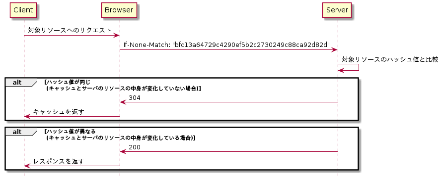
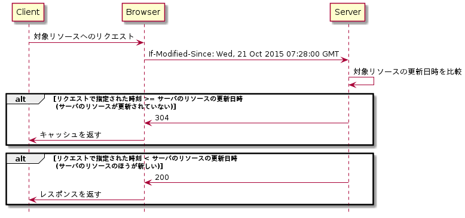
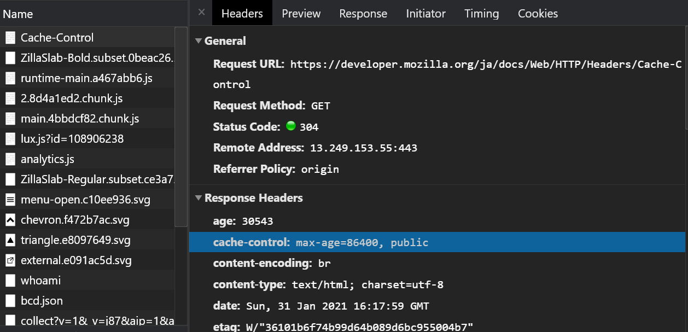
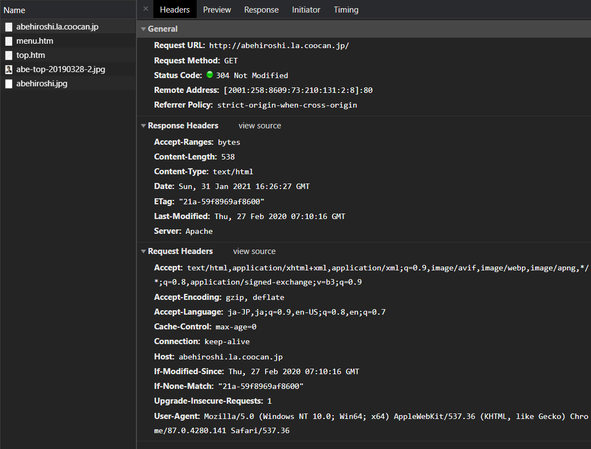
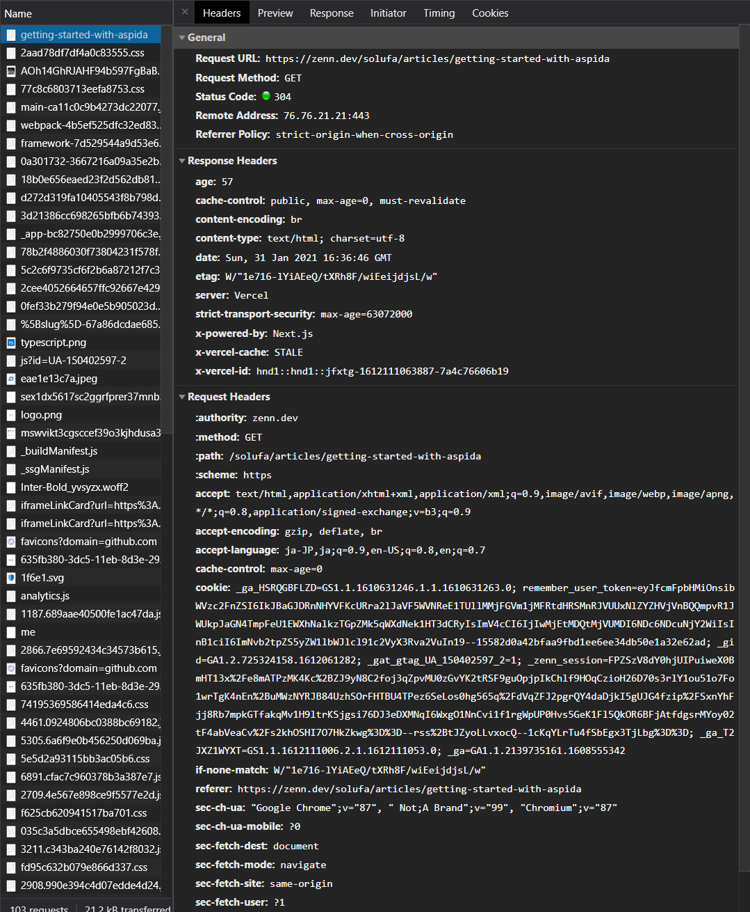

# キャッシュを理解する

<!-- START doctoc generated TOC please keep comment here to allow auto update -->
<!-- DON'T EDIT THIS SECTION, INSTEAD RE-RUN doctoc TO UPDATE -->
<details>
<summary>Table of Contents</summary>

- [課題1](#%E8%AA%B2%E9%A1%8C1)
  - [なぜキャッシュが必要なのか](#%E3%81%AA%E3%81%9C%E3%82%AD%E3%83%A3%E3%83%83%E3%82%B7%E3%83%A5%E3%81%8C%E5%BF%85%E8%A6%81%E3%81%AA%E3%81%AE%E3%81%8B)
  - [キャッシュの種類](#%E3%82%AD%E3%83%A3%E3%83%83%E3%82%B7%E3%83%A5%E3%81%AE%E7%A8%AE%E9%A1%9E)
  - [HTTPヘッダによるブラウザキャッシュの制御](#http%E3%83%98%E3%83%83%E3%83%80%E3%81%AB%E3%82%88%E3%82%8B%E3%83%96%E3%83%A9%E3%82%A6%E3%82%B6%E3%82%AD%E3%83%A3%E3%83%83%E3%82%B7%E3%83%A5%E3%81%AE%E5%88%B6%E5%BE%A1)
    - [リクエストヘッダ](#%E3%83%AA%E3%82%AF%E3%82%A8%E3%82%B9%E3%83%88%E3%83%98%E3%83%83%E3%83%80)
    - [レスポンスヘッダ](#%E3%83%AC%E3%82%B9%E3%83%9D%E3%83%B3%E3%82%B9%E3%83%98%E3%83%83%E3%83%80)
  - [実際に設定するレスポンスヘッダの値](#%E5%AE%9F%E9%9A%9B%E3%81%AB%E8%A8%AD%E5%AE%9A%E3%81%99%E3%82%8B%E3%83%AC%E3%82%B9%E3%83%9D%E3%83%B3%E3%82%B9%E3%83%98%E3%83%83%E3%83%80%E3%81%AE%E5%80%A4)
    - [Last-Modified](#last-modified)
    - [ETag](#etag)
    - [Cache-Control](#cache-control)
    - [Cache-Controlのディレクティブの決定フロー](#cache-control%E3%81%AE%E3%83%87%E3%82%A3%E3%83%AC%E3%82%AF%E3%83%86%E3%82%A3%E3%83%96%E3%81%AE%E6%B1%BA%E5%AE%9A%E3%83%95%E3%83%AD%E3%83%BC)
  - [ブラウザごとのキャッシュサイズの違い](#%E3%83%96%E3%83%A9%E3%82%A6%E3%82%B6%E3%81%94%E3%81%A8%E3%81%AE%E3%82%AD%E3%83%A3%E3%83%83%E3%82%B7%E3%83%A5%E3%82%B5%E3%82%A4%E3%82%BA%E3%81%AE%E9%81%95%E3%81%84)
  - [動的サイトへの `Expires` ヘッダの是非](#%E5%8B%95%E7%9A%84%E3%82%B5%E3%82%A4%E3%83%88%E3%81%B8%E3%81%AE-expires-%E3%83%98%E3%83%83%E3%83%80%E3%81%AE%E6%98%AF%E9%9D%9E)
  - [ブラウザキャッシュの実例を3つ紹介](#%E3%83%96%E3%83%A9%E3%82%A6%E3%82%B6%E3%82%AD%E3%83%A3%E3%83%83%E3%82%B7%E3%83%A5%E3%81%AE%E5%AE%9F%E4%BE%8B%E3%82%923%E3%81%A4%E7%B4%B9%E4%BB%8B)
- [課題2](#%E8%AA%B2%E9%A1%8C2)
- [課題3](#%E8%AA%B2%E9%A1%8C3)
- [課題4](#%E8%AA%B2%E9%A1%8C4)

</details>
<!-- END doctoc generated TOC please keep comment here to allow auto update -->

## 課題1 

### なぜキャッシュが必要なのか

ネットワークでのキャッシュの利点を考えるために、まずはキャッシュがない世界がどのようなものなのか考える。

- サイズの大きいファイルをリクエストすると、毎回ブラウザとサーバ間で大量のラウンドトリップが発生する
  - ラウンドトリップ: ネットワークにおいてリクエストを行い、対応するレスポンスが返ってくるまでの過程のこと
  - ラウンドトリップの増加は、ネットワークの遅延などを引き起こす
- データ通信容量に制限がある場合、ネットワーク上のリソースと紐づくリソースをダウンロードする必要があり、通信制限に引っかかりやすくなる

上記のような **レイテンシの増大** と **ネットワーク帯域の圧迫** といった様々な問題が発生してしまう。

しかし一度ダウンロードしたリソースに対して、次回以降ブラウザに保存されているキャッシュをうまく活用することで、ネットワーク帯域幅を余分に使用することなく、リソースを読み込む事ができる

これはコンピュータに搭載されているL2キャッシュやL3キャッシュの役割と似ており、これらはCPUの処理速度とハードディスクの処理速度の違いを吸収することで、メモリアクセスを高速化を実現している。

ネットワークにおけるキャッシュも似たような考え方に基づいている。

参考資料

- [Prevent unnecessary network requests with the HTTP Cache](https://web.dev/http-cache/)

---

### キャッシュの種類

キャッシュは大きく分けて **プライベートキャッシュ** と **共有キャッシュ** というカテゴリーに分類する事ができる。

- プライベートキャッシュ
  - 特定のユーザーに対して、リソースの配信などを高速化するために使用される
  - **HTTP** でダウンロードした全ての文書をブラウザなどのクライアントで保持する
  - 保持された文書を使用することで、サーバと追加のやりとりを行う必要なく、ブラウザの戻るやページ保存、ソースの表示といった各種機能をより高速に実現する
- 共有キャッシュ
  - プロキシキャッシュ
    - 複数のユーザーに対して、再利用されるリソースへのアクセスの高速化のために使用される
    - プロキシにキャッシュを保存することで、ISPや企業は何度もアクセスされるリソースに対するトラフィックや遅延の低減を実現できる
  - ゲートウェイキャッシュ
    - リバースプロキシキャッシュなどとも呼ばれる
    - ISPがネットワーク帯域の節約のために導入するプロキシキャッシュとは異なり、Webサービス提供者がサイトの安定性や性能を改善するために設定する
    - CDNが具体的なサービスの1つである

> MDNではこの2つが記載されていたが、他にもキャッシュの種類は存在しているのか

参考資料
　
- [[MDN] HTTP Cache](https://developer.mozilla.org/ja/docs/Web/HTTP/Caching)

---

### HTTPヘッダによるブラウザキャッシュの制御

HTTPリクエストを送信するときの流れは以下になる。

1. HTTPリクエストを発行する
2. ブラウザのキャッシュにルーティングされる
3. ブラウザのキャッシュがリクエストの要求を満たすのか検証する
   - Yes: レスポンスをキャッシュから読み出す
   - No: サーバにリクエストを転送する

上記の中で、ブラウザキャッシュに対して何を検証するのかは、リクエストヘッダとレスポンスヘッダで制御する事が可能である。

ではそれぞれのヘッダでどのような制御が可能なのか見ていく

---

#### リクエストヘッダ

リクエストヘッダの特徴としては、リクエストを送信する際にブラウザが **自動的**　にキャッシュに対して制御を行うためのヘッダを付与する点である。

これで HTML ファイル内に `` が存在していたとしても、ブラウザが自動的に保存されているキャッシュに対して制御を実行する。

ブラウザが設定するヘッダは以下になる。

- `If-None-Match`
  
  

- `If-Modified-Since`
  
  

処理を見るとわかるように、キャッシュとサーバのリソースの情報を比較するという目的は共通しており、その比較をファイルの中身のハッシュ値で比較しているのか、更新日時で指定しているのかの違いである。

なお Fetch API などを使用してリクエストを発行する場合には、リクエストヘッダにキャッシュに対する制御を行う事ができる。

```js
fetch("http://localhost:8080", {
  cache: "no-store"
})
```

Fetch API で設定できるキャッシュの種類は以下になる。

| キャッシュ値     | 内容                                                                                                                                                                                                                                                                                                                                                                                                                     | 
| ---------------- | ------------------------------------------------------------------------------------------------------------------------------------------------------------------------------------------------------------------------------------------------------------------------------------------------------------------------------------------------------------------------------------------------------------------------ | 
| `default`        | ブラウザは、リクエストの要求を満たすリソースがHTTPキャッシュに存在するのか検証する<br><br>* match & fresh<br>⇨ HTTPキャッシュが返される<br>* match & stale<br>⇨ サーバに条件付きリクエストを送信し、中身が変化していればサーバからリソースが返され、中身が同じならばHTTPキャッシュが返される<br>* dismatch<br>⇨ 通常のリクエストを送信し、HTTPキャッシュを新たなリソースで更新する                                    | 
| `no-store`       | ブラウザはHTTPキャッシュを確認せずにリクエストをサーバに送信する<br><br>HTTPキャッシュを新たなリソースで **更新することはしない**                                                                                                                                                                                                                                                                                        | 
| `reload`         | ブラウザはHTTPキャッシュを確認せずにリクエストをサーバに送信する<br><br>HTTPキャッシュを新たなリソースで**更新する**                                                                                                                                                                                                                                                                                                     | 
| `no-cache`       | ブラウザは、リクエストの要求を満たすリソースがHTTPキャッシュに存在するのか検証する<br><br>* match & (fresh &#124; stale)<br>⇨ 条件付きリクエストをサーバに送信する。<br>中身が同じ場合はHTTPキャッシュからリソースが返される<br>中身が異なる場合は新たなリソースがダウンロードされ、HTTPキャッシュも更新される<br>* dismatch<br>⇨ 通常のリクエストを送信して新たなリソースをダウンロードし、HTTPキャッシュも更新される | 
| `force-cache`    | ブラウザは、リクエストの要求を満たすリソースがHTTPキャッシュに存在するのか検証する<br><br>* match & (fresh &#124; stale)<br>⇨ HTTPキャッシュが返される<br>* dismatch<br>⇨ 通常のリクエストを送信して新たなリソースをダウンロードし、HTTPキャッシュも更新される                                                                                                                                                         | 
| `only-if-cached` | ブラウザは、リクエストの要求を満たすリソースがHTTPキャッシュに存在するのか検証する<br><br>* match & (fresh &#124; stale)<br>⇨ HTTPキャッシュが返される<br>* dismatch<br>⇨ ブラウザは504 Gateway Timeout のステータスコードを返す<br><br>リクエストの mode が、`same-origin` の場合にのみ使用される                                                                                                                     | 

参考資料

- [[MDN] If-None-Match](https://developer.mozilla.org/ja/docs/Web/HTTP/Headers/If-None-Match)
- [[MDN] If-Modified-Since](https://developer.mozilla.org/ja/docs/Web/HTTP/Headers/If-Modified-Since)
- [[MDN] HTTP条件付きリクエスト](https://developer.mozilla.org/ja/docs/Web/HTTP/Conditional_requests)
- [[MDN] Request.cache](https://developer.mozilla.org/en-US/docs/Web/API/Request/cache)

---

#### レスポンスヘッダ

サーバ側が設定するレスポンスヘッダによって、HTTPキャッシュを制御する事が可能である。

主に使用されるHTTPヘッダは以下の3種類である。

- `Cache-Control`
  - この HTTP ヘッダを使用する事で、ブラウザがキャッシュをどのように、またどの程度の期間保存するのか制御する事ができる
- `ETag`
  - サーバのリソースに対して小さな Token を割り当てる
  - ブラウザからのレスポンスで、HTTP キャッシュの該当する値を送信することで、対象リソースが変更されているのか検証できる
- `last-Modified`
  - 目的自体は `ETag` と同じではあるが、リソースに対して有効期限を設定することで HTTP キャッシュを制御する

デフォルトでどのような値が設定されるのかは、使用しているWebアプリケーションに応じて異なっている。

なお `Cache-Control` ヘッダを省略しても HTTP キャッシュが無効になるわけではない。ブラウザが特定のタイプのコンテンツに対して、どのタイプのキャッシュ制御が適用できるのか効率的に推測している。

参考資料

- [[MDN] Cache-Control](https://developer.mozilla.org/docs/Web/HTTP/Headers/Cache-Control)
- [[MDN] ETag](https://developer.mozilla.org/docs/Web/HTTP/Headers/ETag)
- [[MDN] Last-Modified](https://developer.mozilla.org/docs/Web/HTTP/Headers/Last-Modified)
- [[Express] express.static](https://expressjs.com/en/api.html#express.static)
- [[Nginx] ngx_http_headers_module](http://nginx.org/en/docs/http/ngx_http_headers_module.html)

---

### 実際に設定するレスポンスヘッダの値

#### Last-Modified

特徴は以下になる。

- リソースが最後に変更されたとオリジンのサーバが判断している日時を含んでいる。
- `ETag` ヘッダよりも制度は低い
- 検証するタイミング
  - 条件付きリクエストに特定のHTTPヘッダが付与されている
    - `If-Modified-Since`
    - `If--Unmodified-Since`
- 構文

  ```bash
  Last-Modified: <day-name>, <day> <month> <year> <hour>:<minute>:<second> GMT
  ```

- 具体例

  ```bash
  Last-Modified: Wed, 21 Oct 2015 07:28:00 GMT
  ```

- [RFC 7232, セクション 2.2: Last-Modified](https://tools.ietf.org/html/rfc7232#section-2.2)
- [[MDN] If-Modified-Since](https://developer.mozilla.org/ja/docs/Web/HTTP/Headers/If-Modified-Since)
- [[MDN] If-Unmodified-Since](https://developer.mozilla.org/ja/docs/Web/HTTP/Headers/If-Unmodified-Since)

---

#### ETag

特徴は以下になる。

- リソースの特定バージョンの識別子を示す
- リソースが同時に更新されて互いに上書きしてしまう空中衝突を防ぐ
- 構文

  ```bash
  # 弱いバリデーターを使用する
  ETag: W/"<etag_value>"

  # 要求されたリソースを一意に表すエンティティタグ
  ETag: "<etag_value>"
  ```

参考資料

- [RFC 7232, セクション 2.3: ETag](https://developer.mozilla.org/ja/docs/Web/HTTP/Headers/ETag)
- [空中衝突](https://developer.mozilla.org/ja/docs/Web/HTTP/Headers/ETag#Caching_of_unchanged_resources)

---

#### Cache-Control

リクエストとレスポンスの両方で使用されることのあるヘッダであり、標準的に以下のディレクティブを使用することが多い。

| ディレクティブ        | 内容                                                                                                                                          | 
| --------------------- | --------------------------------------------------------------------------------------------------------------------------------------------- | 
| `public`              | レスポンスを、ブラウザキャッシュや共有キャッシュなど、どの種類のキャッシュにも保存する                                                        | 
| `private`             | レスポンスをブラウザキャッシュに格納する                                                                                                      | 
| `no-cache`            | キャッシュされているリソースを使用する前に、必ずリソースに対してオリジンサーバと検証を行う必要がある                                          | 
| `no-store`            | レスポンスをキャッシュに保存することはできない                                                                                                | 
| `max-age=<seconds>`   | リソースをキャッシュに保存しておく最長時間を設定する<br><br>`Expires`と異なり、リクエスト時刻からの相対時間となる                             | 
| `s-maxage=<seconds>`  | 共有キャッシュのためだけに使用され、ブラウザキャッシュでは無視される<br><br>`max-age`や`Expires`の値を上書きする                              | 
| `max-stale=<seconds>` | クライアントが、どの程度の古いリソースまで受け入れるのか指定する<br><br>オプションで秒数を設定することができる                                | 
| `must-revalidate`     | キャッシュのリソースが古くなると、オリジンサーバでの検証が成功しない限り、キャッシュのリソースは使用できなくなる                              | 
| `proxy-revalidate`    | 動作は `must-revalidate` と似ているが、ブラウザキャッシュは無視され、共有キャッシュに対してのみ適用される                                     | 
| `no-transform`        | 中間キャッシュやプロキシが、レスポンスの `Content-Type` や `Content-Range` 、 `Content-Encoding` などのリソース情報を変更してはいけない       | 
| `only-if-cached`      | ネットワーク通信を使用せず、キャッシュのリソースのみを使用する<br><br>保存されたレスポンスを使用して応答するか、ステータスコードを 504 で返す | 

---

#### Cache-Controlのディレクティブの決定フロー

以下の決定フローに従う形でもよさそう

- 

- [Appendix: Cache-Control Flowchart](https://web.dev/http-cache/#flowchart)

---

### ブラウザごとのキャッシュサイズの違い

- Chrome
  - デフォルトキャッシュサイズ: 80MB
  - ただし条件に応じて変化する
  
    | 条件                                                                                         | キャッシュサイズ             | 
| -------------------------------------------------------------------------------------------- | ---------------------------- | 
| デフォルト状態                                                                               | 80MB                         | 
| 利用可能なディスク容量が少ない（100MBより小さい）場合                                        | 利用可能なディスク容量の80％ | 
| デフォルトのキャッシュサイズ（80MB）が、利用可能なディスク容量の10％～80％を占めてしまう場合 | 80MB                         | 
| 特定のサイズ（200MB）が、利用可能なディスク容量の10％を占めてしまう場合                      | 利用可能なディスク容量の10％ | 
| 特定のサイズ（200MB）が、利用可能なディスク容量の1％～10％を占めてしまう場合                 | 200MB                        | 
| 上記のいずれにも該当しない場合                                                               | 利用可能なディスク容量の1％  | 

    - イメージとしては、利用可能なディスク容量が大きい場合、その分キャッシュサイズも確保している

- Firefox
  - デフォルトで50MB
  - クォータマネージャという内部のブラウザツールが生成元ごとに、使用しているディスク容量を監視し、必要に応じてデータを削除する
- Safari
  - デフォルトは5MB

大まかな挙動としては、キャッシュサイズの上限に到達すると、 **origin eviction** と呼ばれる処理を実行し、上限を下回るまで生成元全体に相当するデータを削除する。

注意点は、データ内に矛盾を発生させないために、生成元の単位でデータをすべて削除する点である。

- [[Chronium Code Search] cache_util.cc](https://source.chromium.org/chromium/chromium/src/+/master:net/disk_cache/cache_util.cc;l=87?q=defaultCacheSize&ss=chromium)
- [[SearchFox] CacheFileIOManager](https://searchfox.org/mozilla-central/source/netwerk/cache2/CacheFileIOManager.cpp#2769)
- [Set the Maximum Cache Size in FireFox](https://ccm.net/faq/40819-firefox-36-how-to-set-the-maximum-cache-size)
- [Offline Storage for Progressive Web Apps](https://medium.com/dev-channel/offline-storage-for-progressive-web-apps-70d52695513c#.mj8pndkae)
- [[MDN] ブラウザーのストレージ制限と削除基準](https://developer.mozilla.org/ja/docs/Web/API/IndexedDB_API/Browser_storage_limits_and_eviction_criteria)

### 動的サイトへの `Expires` ヘッダの是非

`Expires` ヘッダでは、キャッシュに保存されたレスポンスが古くなった（`stale`）と判断される時間、つまり有効期限を、`HTTP-date` の形式で設定できる。

重要な点は、サーバ上のコンテンツが更新されたとしてもそれが表示されることはない点である。

よって更新頻度が高いような動的サイトには適さない、キャッシュ制御方法である。

参考資料

- [[MDN] Expires](https://developer.mozilla.org/ja/docs/Web/HTTP/Headers/Expires)
- [Caching Tutorial](https://www.mnot.net/cache_docs/)
- [RFC 7234, セクション 5.3: Expires](https://tools.ietf.org/html/rfc7234#section-5.3)

---

### ブラウザキャッシュの実例を3つ紹介

- [MDN Web Docs](https://developer.mozilla.org/ja/docs/Web/HTTP/Headers/Cache-Control)
  - MDN の場合には、提供されるWebページに `max-age=86400, public` が設定されている
  - つまり、ブラウザキャッシュか共有キャッシュにレスポンスが1日保存されている

    

- [阿部寛のホームページ](http://abehiroshi.la.coocan.jp/)
  - このページでは `Cache-Control` などのヘッダは提供されていない
  - そこで `ETag` とリクエストの `If-None-Match` を使ってリソースの比較を実施している
  - 2回目以降はキャッシュからリソースが取得される

    

- [zenn.dev](https://zenn.dev/solufa/articles/getting-started-with-aspida)
  - `Cache-Control` には `public, max-age=0, must-revalidate` が設定されている
  - これはブラウザキャッシュ、あるいはっ共有キャッシュに保存されているレスポンスを、必ずオリジンサーバに対して検証処理を実行するようになっている

    

全体的に静的コンテンツは、`public` が設定されていることが多く、有効期限を0に設定してオリジンサーバへの検証処理を必ず実行しているように感じる。

---

## 課題2

以下の条件に従うサーバを構築する。

- 何かしらの画像を返す
- 2つのエンドポイントを用意する
  - 1つ目: 同じクライアントからのアクセスの場合、キャッシュを使用してアクセス負荷を減らす
  - 2つ目: ブラウザキャッシュを使用せずに画像を返す
- 実装
  - [./cache](./cache)

## 課題3

ブラウザキャッシュを使うべきではない事例を考える際に、そもそもキャッシュとして扱うことのできるデータの性質を考える。

- データ消去が許容できること
  - キャッシュは様々なタイミングで消去される
    - 有効期限が切れる
    - キャッシュサーバを再起動する
    - 無効化される
- 読み込み頻度が高いこと
  - 頻繁に読み込まれるデータをキャッシュにするほうが恩恵を受けやすい
  - つまりユニークなデータではないほうがいい
- 書き込み頻度が低いこと
  - データの更新が多いと、キャッシュの整合性にコストがかかる
  - 静的なデータをキャッシュするほうがいい

この性質を考えると、以下のようなサービスとは相性が悪いと考えられる。

- Slackのようなリアルタイムチャットアプリ
  - Slack の URL は `/client/<clientID>/<pageID>` とおそらくなっている
  - このURLのページは頻繁に書き込まれる可能性があるため、

## 課題4

- [./quiz](./quiz)

## 参考資料

- HTTPキャッシュ全般に関する資料
  - [[web.dev] Prevent unnecessary network requests with the HTTP Cache](https://web.dev/http-cache/)
  - [Caching Tutorial](https://www.mnot.net/cache_docs/#REF)
  - [Caching best practices & max-age gotchas](https://jakearchibald.com/2016/caching-best-practices/)
  - [[Sansan] Webアプリケーションにおける正しいキャッシュ戦略](https://buildersbox.corp-sansan.com/entry/2019/03/25/150000)
  - [HTTP キャッシュおさらい](https://techblog.lclco.com/entry/2019/02/28/170051)
  - [HTTP Caching](https://developers.google.com/web/fundamentals/performance/get-started/httpcaching-6)
- ブラウザごとのキャッシュサイズの調査
  - [[Chronium Code Search] cache_util.cc](https://source.chromium.org/chromium/chromium/src/+/master:net/disk_cache/cache_util.cc;l=87?q=defaultCacheSize&ss=chromium)
  - [What is Chrome default cache size limit?](https://superuser.com/questions/378991/what-is-chrome-default-cache-size-limit)
  - [Storage for the web](https://web.dev/storage-for-the-web/#how-much)
  - [[firefox] how to increase cache size](https://support.mozilla.org/en-US/questions/1272857)
  - [Offline Storage for Progressive Web Apps](https://medium.com/dev-channel/offline-storage-for-progressive-web-apps-70d52695513c#.mj8pndkae)
- キャッシュの性能への影響
  - [Increasing Application Performance with HTTP Cache Headers](https://devcenter.heroku.com/articles/increasing-application-performance-with-http-cache-headers#use-cases)
  - [HOW WEB CACHING IMPROVES INTERNET PERFORMANCE](https://www.3pillarglobal.com/insights/blog-posts/how-web-caching-improves-internet-performance/)
  - [キャッシュとは？Webサイト高速化にかかせない機能をご紹介！](https://digitalidentity.co.jp/blog/seo/seo-tech/cash-speed-up.html)
  - [[キャッシュ屋ブログ] HTTPヘッダチューニング Expiresヘッダについて](https://blog.redbox.ne.jp/http-header-expires.html)
  - [[さくらのナレッジ] CDNのメリットとデメリット〜Web制作/運営の幅が広がるCDNを知ろう第2回〜](https://knowledge.sakura.ad.jp/19825/)
