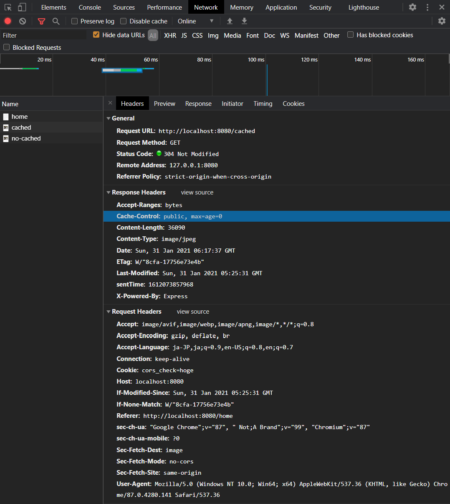
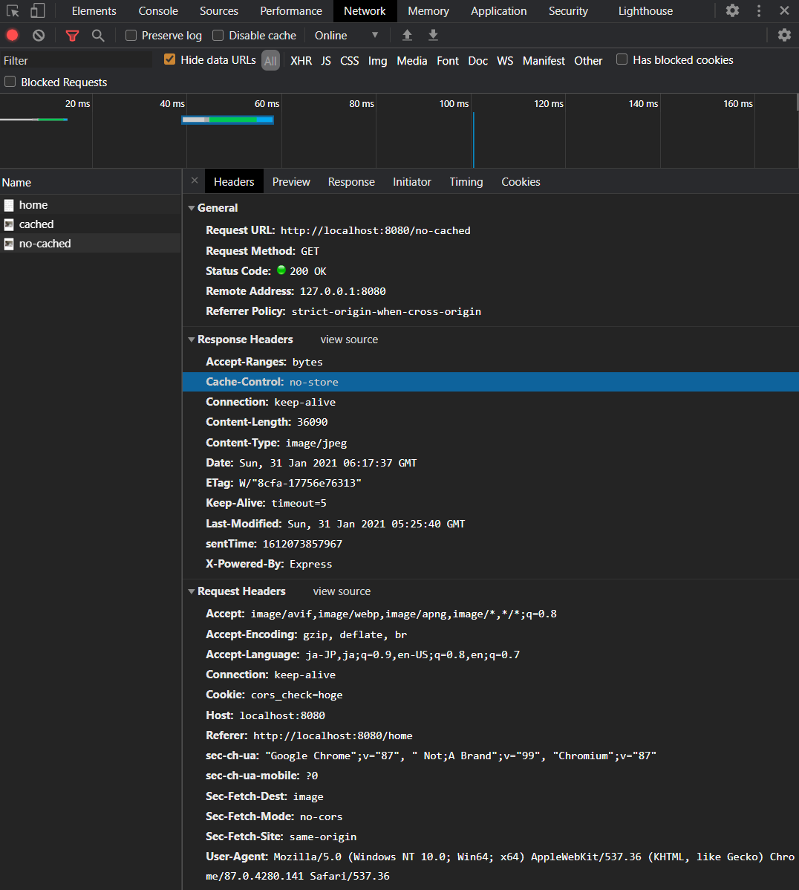

# 課題 2

猫の画像を返す、簡単な Web サーバを構築した。

## 確認手順

1. VSCode の Remote Containers 機能を使ってコンテナにアクセスする

  ```bash
  Remote-Container: Open Folder in Container
  ```

2. パッケージをインストールする

  ```bash
  $ yarn
  ```

3. TypeScript のコンパイルを実行する

  ```bash
  $ yarn run tsc
  ```

4. Node を起動する

  ```bash
  $ yarn run dev
  ```

5. `http://localhost:8080` にアクセスする

  ```bash
  $ {'message': 'Welcome !!}
  ```

6. `http://localhost:8080/home` にアクセスする

  - 2度目のアクセスでキャッシュされているか確認する
  - キャッシュ設定あり

    

    ステータスコードが 304 に設定されている
    これはキャッシュメモリから提供されている

  - キャッシュ設定なし

    

    ステータスコードが 200 に設定されている
    ネットワーク越しにファイルをダウンロードしている
