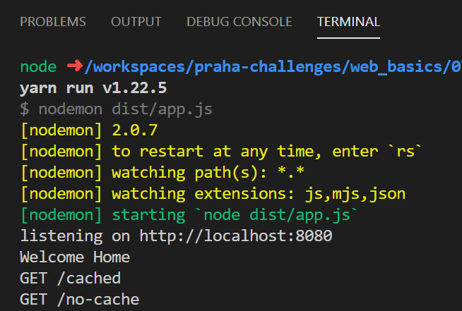
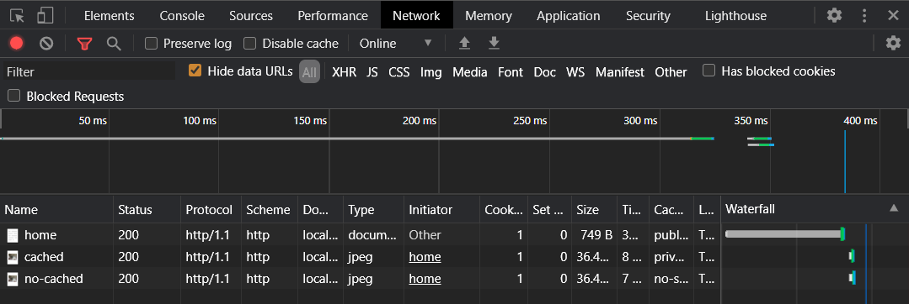
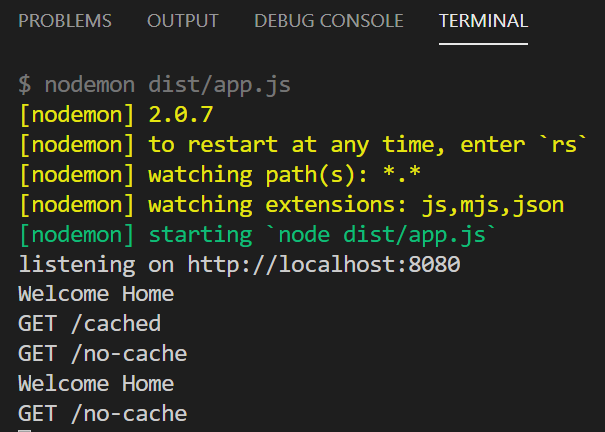
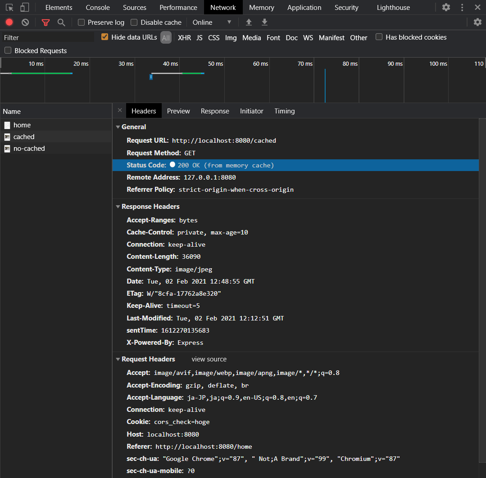
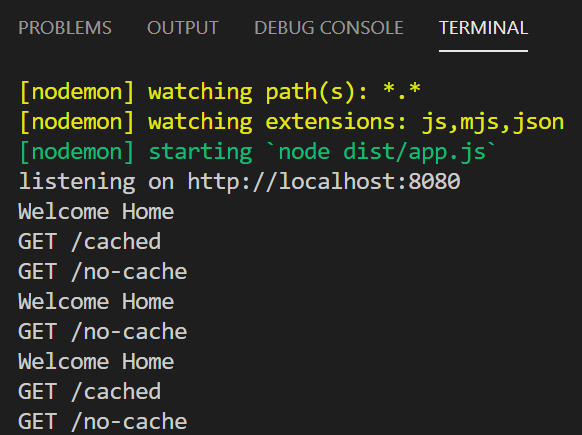
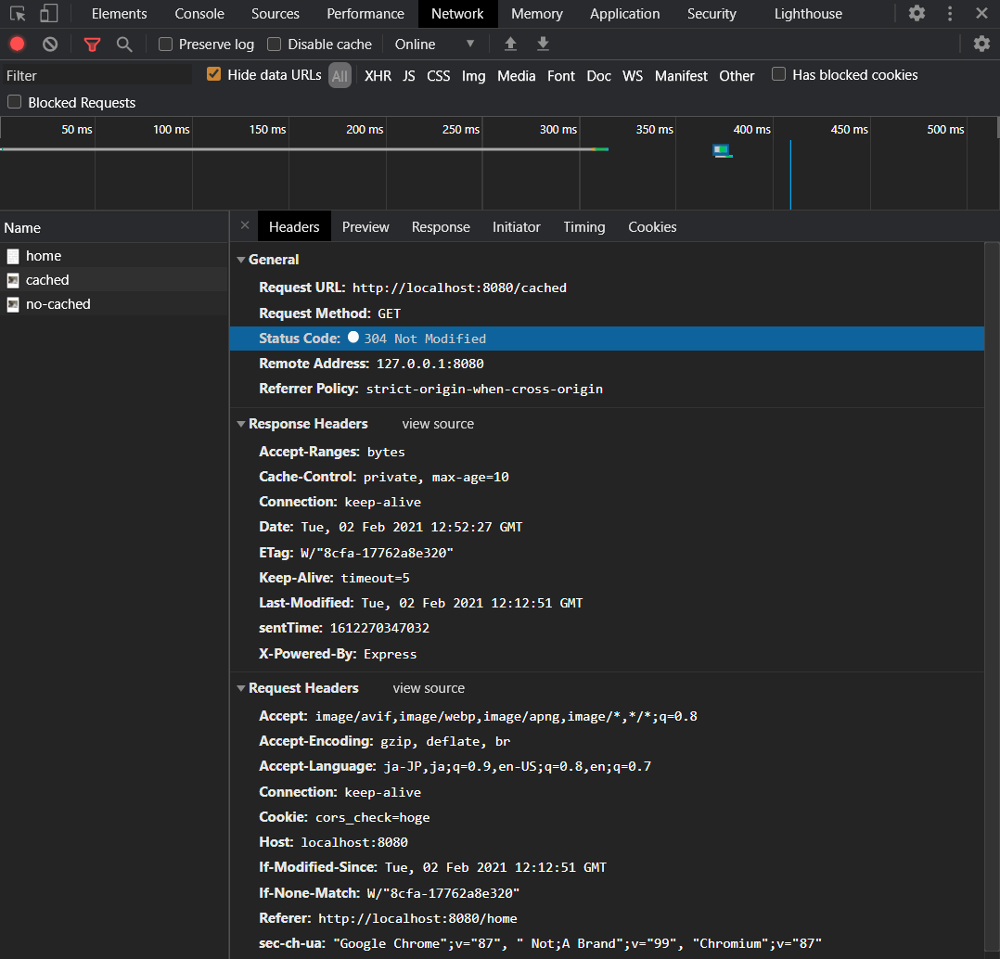

# 課題 2

猫の画像を返す、簡単な Web サーバを構築した。

<!-- START doctoc generated TOC please keep comment here to allow auto update -->
<!-- DON'T EDIT THIS SECTION, INSTEAD RE-RUN doctoc TO UPDATE -->
<details>
<summary>Table of Contents</summary>

- [確認手順](#%E7%A2%BA%E8%AA%8D%E6%89%8B%E9%A0%86)

</details>
<!-- END doctoc generated TOC please keep comment here to allow auto update -->

## 確認手順

1. VSCode の Remote Containers 機能を使ってコンテナにアクセスする

    ```bash
    Remote-Container: Open Folder in Container
    ```

2. パッケージをインストールする

    ```bash
    $ yarn install --frozen-lockfile
    ```

    - [yarn install --frozen-lockfile](https://classic.yarnpkg.com/en/docs/cli/install/#toc-yarn-install-frozen-lockfile)

3. TypeScript のコンパイルを実行する

    ```bash
    $ yarn run tsc
    ```

4. Node を起動する

    ```bash
    $ yarn run dev
    ```

5. `http://localhost:8080` にアクセスする

    ```bash
    $ {'message': 'Welcome !!}
    ```

6. `http://localhost:8080/home` にアクセスする

    - 初回アクセスを行う

        - サーバ側のアクセスログを見ると、キャッシュを設定しているエンドポイントと、キャッシュを無効化しているエンドポイントの両方にリクエストが飛んできていることがわかる

            

        - ブラウザ側のリクエストログを見てみても、どちらもステータスコード 200 でサーバから画像を取得していることがわかる

            

    - キャッシュの有効期限が切れる前に、再度同じリソースにリクエストを送信する

        - サーバ側のアクセスログを見ると、キャッシュを設定しているエンドポイントにはリクエストが送信されておらず、キャッシュを無効化しているエンドポイントには引き続いてリクエストが送信されていることがわかる

            

        - ブラウザ側のリクエストロスを見てみると、どちらもステータスコード 200 ではあるが、キャッシュされているリソースに対するリクエストでは **(from memory cache)** と表示されており、ブラウザキャッシュからリソースが提供されていることがわかる

            

    - キャッシュの有効期限が切れた後に、再度同じリソースにリクエストを送信する

        - サーバ側のアクセスログを見ると、キャッシュを設定しているエンドポイントと、キャッシュを無効化しているエンドポイントの両方に対してリクエストが送信されていることがわかる

            

        - ブラウザ側のリクエストログを見てみると、キャッシュの有効期限が切れたリソースに対してリクエストが送信されており、サーバ側のリソースの中身が変更されていないために、ステータスコード 304 でレスポンスが返ってきていることがわかる

            

参考資料

- [What is the difference between HTTP status code 200 (cache) vs status code 304?](https://stackoverflow.com/questions/1665082/what-is-the-difference-between-http-status-code-200-cache-vs-status-code-304#:~:text=The%20items%20with%20code%20%22200,you%20triggered%20the%20new%20request%2C)
- [Why does Browser still sends request for cache-control public with max-age?](https://stackoverflow.com/questions/18557251/why-does-browser-still-sends-request-for-cache-control-public-with-max-age)